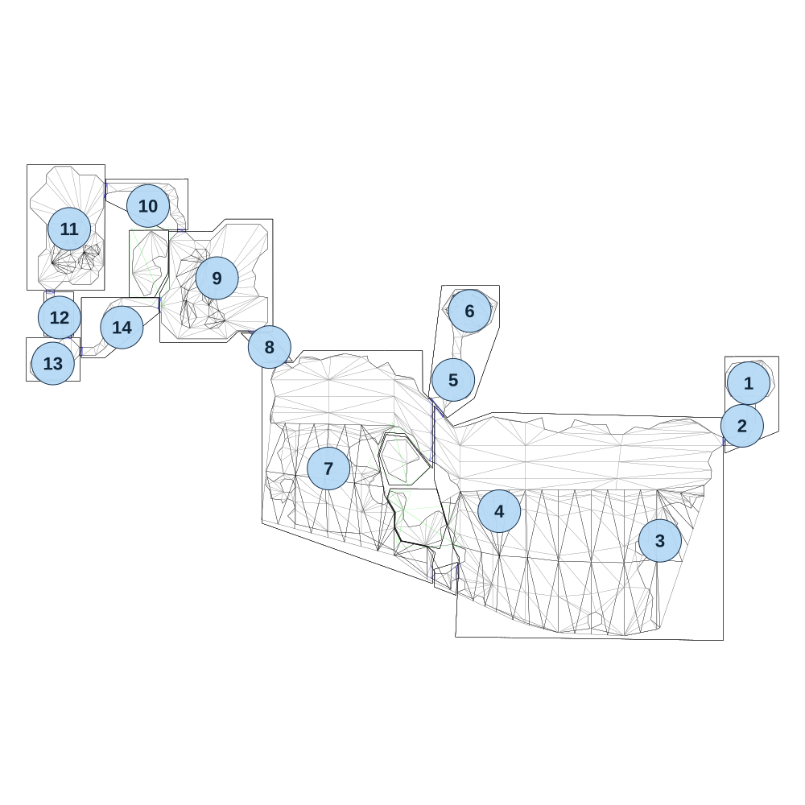

# map_jungle06_00

[All map wireframes](README.md)

[SVG](map_jungle06_00.svg) · [PNG](map_jungle06_00.png) · [Geometry JSON](map_jungle06_00.json)

## Section reference positions

These are markers, not room boundaries or safe spawn points. Positions use the file’s XYZ axes; the wireframe projects X/Z. Rotation is retained raw, not interpreted here.

| Section ID | X | Y | Z | Raw rotation |
|---:|---:|---:|---:|---:|
| 1 | 80 | 0 | -40 | 0 |
| 2 | 60 | 0 | 90 | 0 |
| 3 | -190 | 0 | 440 | 0 |
| 4 | -680 | 0 | 350 | 0 |
| 5 | -820 | 0 | -50 | 0 |
| 6 | -770 | 0 | -260 | 0 |
| 7 | -1200 | 0 | 220 | 0 |
| 8 | -1380 | 0 | -150 | 0 |
| 9 | -1540 | 0 | -360 | 0 |
| 10 | -1750 | 0 | -580 | 0 |
| 11 | -1990 | 0 | -510 | 0 |
| 12 | -2020 | 0 | -240 | 0 |
| 13 | -2040 | 0 | -100 | 0 |
| 14 | -1830 | 0 | -210 | 0 |

Collision triangles: 2058. Sentinel/unlabelled records remain in JSON. Overlapping marker positions are preserved, not moved to invent room locations.
