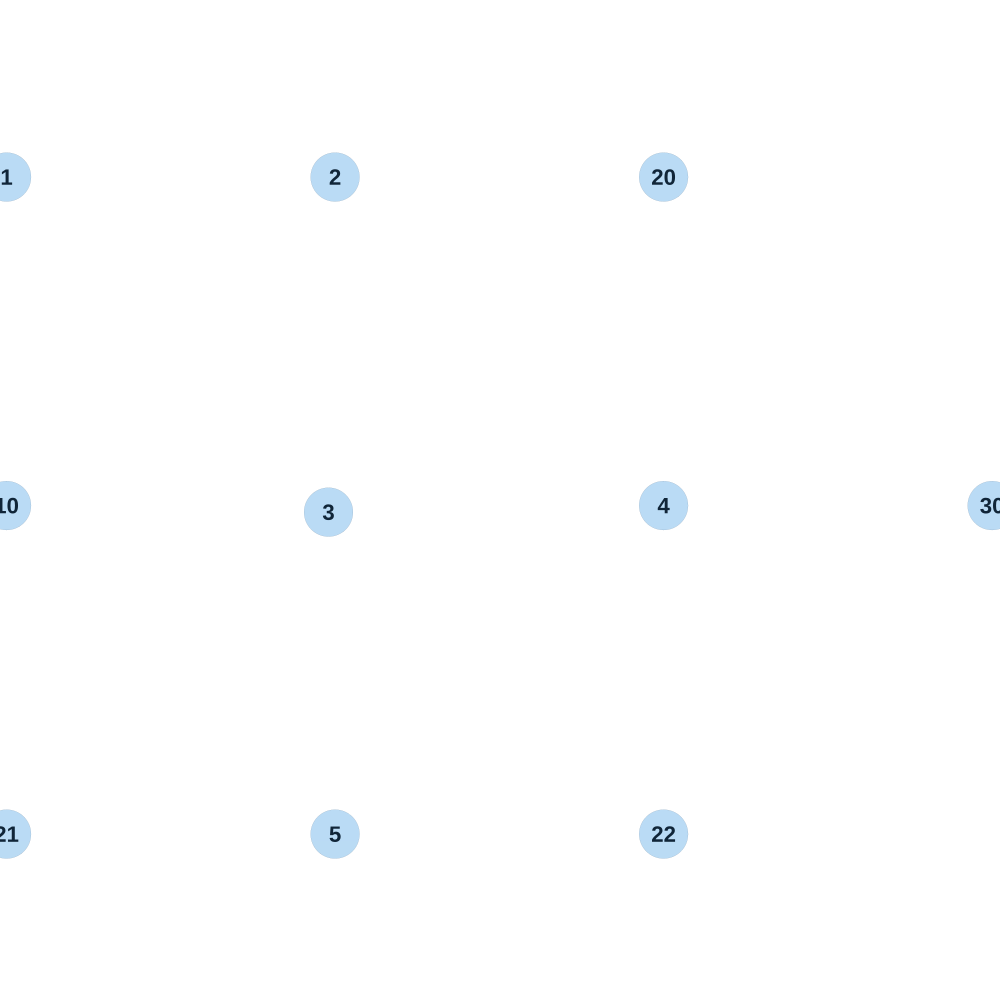

# map_jungle07_04

[All map wireframes](README.md)

[SVG](map_jungle07_04.svg) · [PNG](map_jungle07_04.png) · [Geometry JSON](map_jungle07_04.json)

## Section reference positions

These are markers, not room boundaries or safe spawn points. Positions use the file’s XYZ axes; the wireframe projects X/Z. Rotation is retained raw, not interpreted here.

| Section ID | X | Y | Z | Raw rotation |
|---:|---:|---:|---:|---:|
| 1 | -10000 | 0 | -10000 | 0 |
| 2 | 0 | 0 | -10000 | 0 |
| 3 | -200 | 0 | 200 | 0 |
| 4 | 10000 | 0 | 0 | 0 |
| 5 | 0 | 0 | 10000 | 0 |
| 10 | -10000 | 0 | 0 | 0 |
| 20 | 10000 | 0 | -10000 | 0 |
| 21 | -10000 | 0 | 10000 | 0 |
| 22 | 10000 | 0 | 10000 | 0 |
| 30 | 20000 | 0 | 0 | 0 |

Collision triangles: 3838. Sentinel/unlabelled records remain in JSON. Overlapping marker positions are preserved, not moved to invent room locations.
