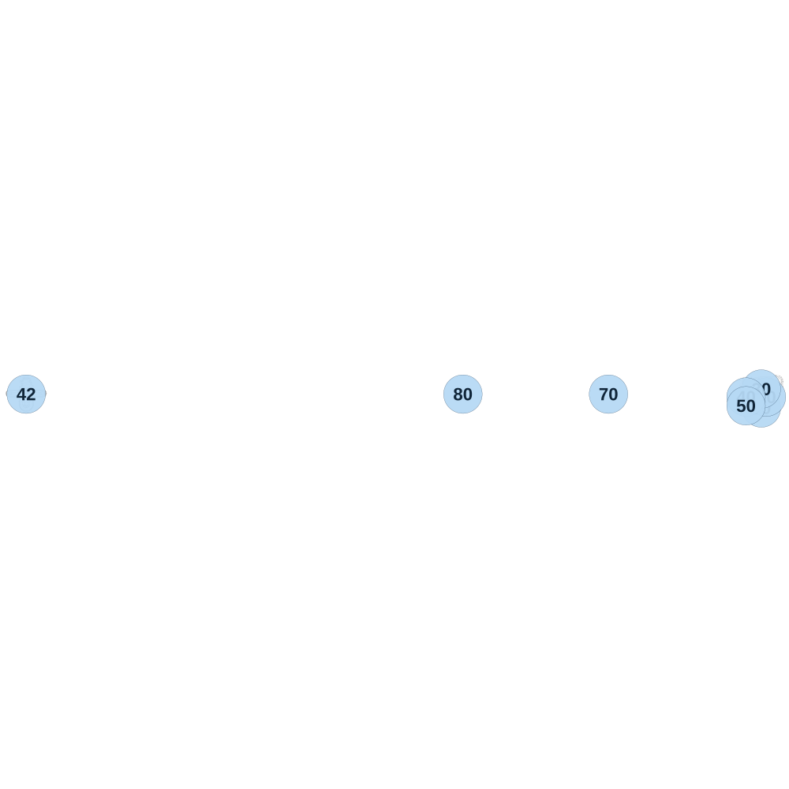

# map_labo00_00

[All map wireframes](README.md)

[SVG](map_labo00_00.svg) · [PNG](map_labo00_00.png) · [Geometry JSON](map_labo00_00.json)

## Section reference positions

These are markers, not room boundaries or safe spawn points. Positions use the file’s XYZ axes; the wireframe projects X/Z. Rotation is retained raw, not interpreted here.

| Section ID | X | Y | Z | Raw rotation |
|---:|---:|---:|---:|---:|
| 10 | 100 | 0 | 190 | 0 |
| 20 | 170 | 0 | 40 | 0 |
| 30 | 100 | 0 | -70 | 0 |
| 40 | -110 | 0 | 40 | 0 |
| 50 | -110 | 0 | 160 | 0 |
| 70 | -2000 | 0 | 0 | 0 |
| 80 | -4000 | 0 | 0 | 0 |
| 42 | -10000 | 0 | 0 | 0 |

Collision triangles: 2152. Sentinel/unlabelled records remain in JSON. Overlapping marker positions are preserved, not moved to invent room locations.
