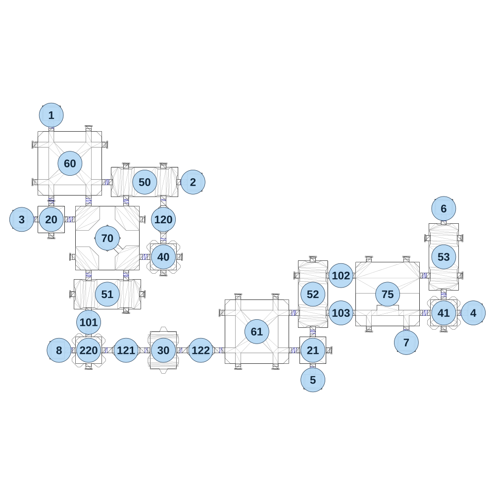

# map_machine01_01

[All map wireframes](README.md)

[SVG](map_machine01_01.svg) · [PNG](map_machine01_01.png) · [Geometry JSON](map_machine01_01.json)

## Section reference positions

These are markers, not room boundaries or safe spawn points. Positions use the file’s XYZ axes; the wireframe projects X/Z. Rotation is retained raw, not interpreted here.

| Section ID | X | Y | Z | Raw rotation |
|---:|---:|---:|---:|---:|
| 101 | 240 | 0 | 1340 | 0 |
| 102 | 1860 | 0 | 1040 | 16383 |
| 103 | 1860 | 0 | 1280 | 16383 |
| 120 | 720 | 0 | 680 | 0 |
| 121 | 480 | 0 | 1520 | 16383 |
| 122 | 960 | 0 | 1520 | 16383 |
| 20 | 0 | 0 | 680 | 0 |
| 21 | 1680 | 0 | 1520 | 0 |
| 50 | 600 | 0 | 440 | 16383 |
| 51 | 360 | 0 | 1160 | 16383 |
| 52 | 1680 | 0 | 1160 | 0 |
| 53 | 2520 | 0 | 920 | 0 |
| 60 | 120 | 0 | 320 | 0 |
| 61 | 1320 | 0 | 1400 | 0 |
| 70 | 360 | 0 | 800 | 32768 |
| 75 | 2160 | 0 | 1160 | 0 |
| 30 | 720 | 0 | 1520 | 16383 |
| 1 | 0 | 0 | 10 | 32768 |
| 2 | 910 | 0 | 440 | 16383 |
| 3 | -190 | 0 | 680 | 49152 |
| 4 | 2710 | 0 | 1280 | 16383 |
| 5 | 1680 | 0 | 1710 | 0 |
| 6 | 2520 | 0 | 610 | 32768 |
| 7 | 2280 | 0 | 1470 | 0 |
| 8 | 50 | 0 | 1520 | 49152 |
| 40 | 720 | 0 | 920 | 0 |
| 41 | 2520 | 0 | 1280 | 0 |
| 220 | 240 | 0 | 1520 | 32768 |

Collision triangles: 5193. Sentinel/unlabelled records remain in JSON. Overlapping marker positions are preserved, not moved to invent room locations.
