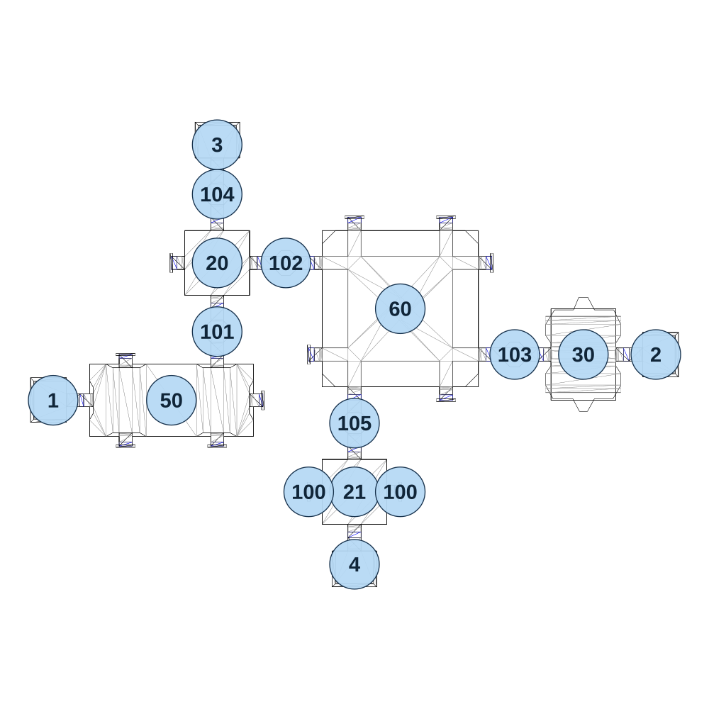

# map_machine01_03

[All map wireframes](README.md)

[SVG](map_machine01_03.svg) · [PNG](map_machine01_03.png) · [Geometry JSON](map_machine01_03.json)

## Section reference positions

These are markers, not room boundaries or safe spawn points. Positions use the file’s XYZ axes; the wireframe projects X/Z. Rotation is retained raw, not interpreted here.

| Section ID | X | Y | Z | Raw rotation |
|---:|---:|---:|---:|---:|
| 101 | -370 | 0 | -5 | 0 |
| 102 | -190 | 0 | -185 | 16383 |
| 103 | 410 | 0 | 55 | 16383 |
| 104 | -370 | 0 | -365 | 0 |
| 105 | -10 | 0 | 235 | 0 |
| 20 | -370 | 0 | -185 | 0 |
| 21 | -10 | 0 | 415 | 0 |
| 50 | -490 | 0 | 175 | 16383 |
| 60 | 110 | 0 | -65 | 0 |
| 30 | 590 | 0 | 55 | 16383 |
| 1 | -800 | 0 | 175 | 49152 |
| 2 | 780 | 0 | 55 | 16383 |
| 3 | -370 | 0 | -495 | 32768 |
| 4 | -10 | 0 | 605 | 0 |
| 100 | 110 | 0 | 415 | 16383 |
| 100 | -130 | 0 | 415 | 16383 |

Collision triangles: 1802. Sentinel/unlabelled records remain in JSON. Overlapping marker positions are preserved, not moved to invent room locations.
