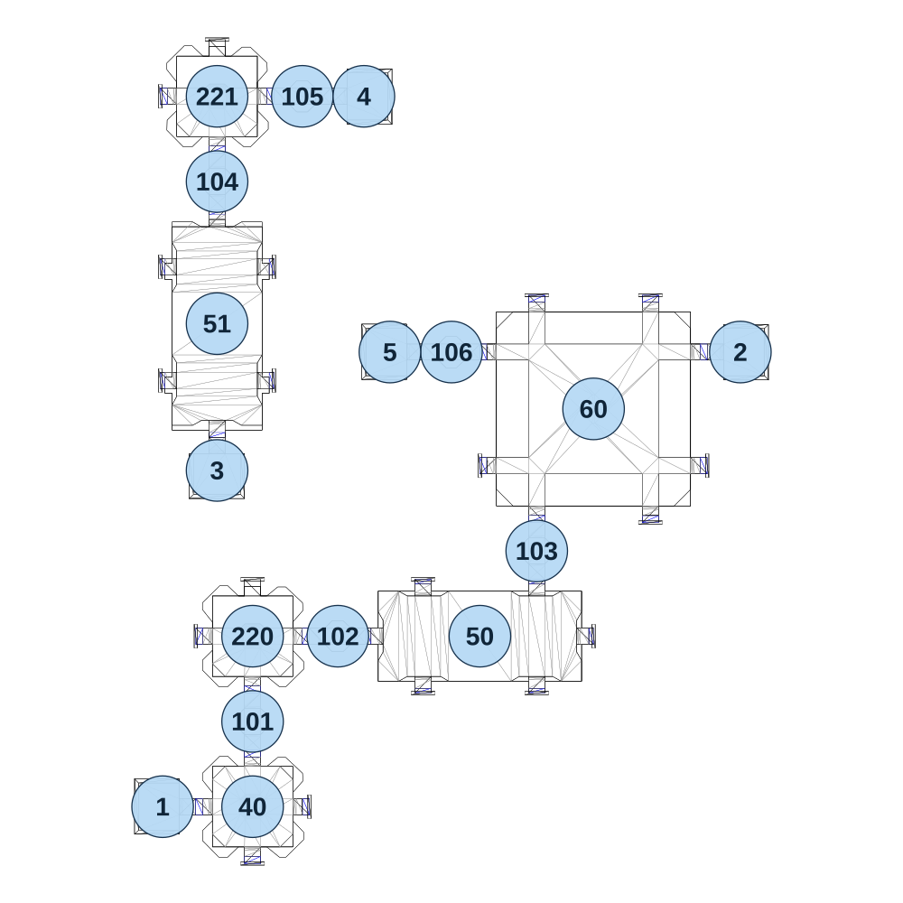

# map_machine01_04

[All map wireframes](README.md)

[SVG](map_machine01_04.svg) · [PNG](map_machine01_04.png) · [Geometry JSON](map_machine01_04.json)

## Section reference positions

These are markers, not room boundaries or safe spawn points. Positions use the file’s XYZ axes; the wireframe projects X/Z. Rotation is retained raw, not interpreted here.

| Section ID | X | Y | Z | Raw rotation |
|---:|---:|---:|---:|---:|
| 101 | -395 | 0 | 180 | 0 |
| 102 | -215 | 0 | -0 | 16383 |
| 103 | 205 | 0 | -180 | 0 |
| 104 | -470 | 0 | -960 | 0 |
| 105 | -290 | 0 | -1140 | 16383 |
| 106 | 25 | 0 | -600 | 16384 |
| 50 | 85 | 0 | -0 | 16383 |
| 51 | -470 | 0 | -660 | 0 |
| 60 | 325 | 0 | -480 | 0 |
| 1 | -585 | 0 | 360 | 49152 |
| 2 | 635 | 0 | -600 | 16383 |
| 3 | -470 | 0 | -350 | 0 |
| 4 | -160 | 0 | -1140 | 16383 |
| 5 | -105 | 0 | -600 | 49152 |
| 40 | -395 | 0 | 360 | 0 |
| 220 | -395 | 0 | -0 | 0 |
| 221 | -470 | 0 | -1140 | 0 |

Collision triangles: 2634. Sentinel/unlabelled records remain in JSON. Overlapping marker positions are preserved, not moved to invent room locations.
