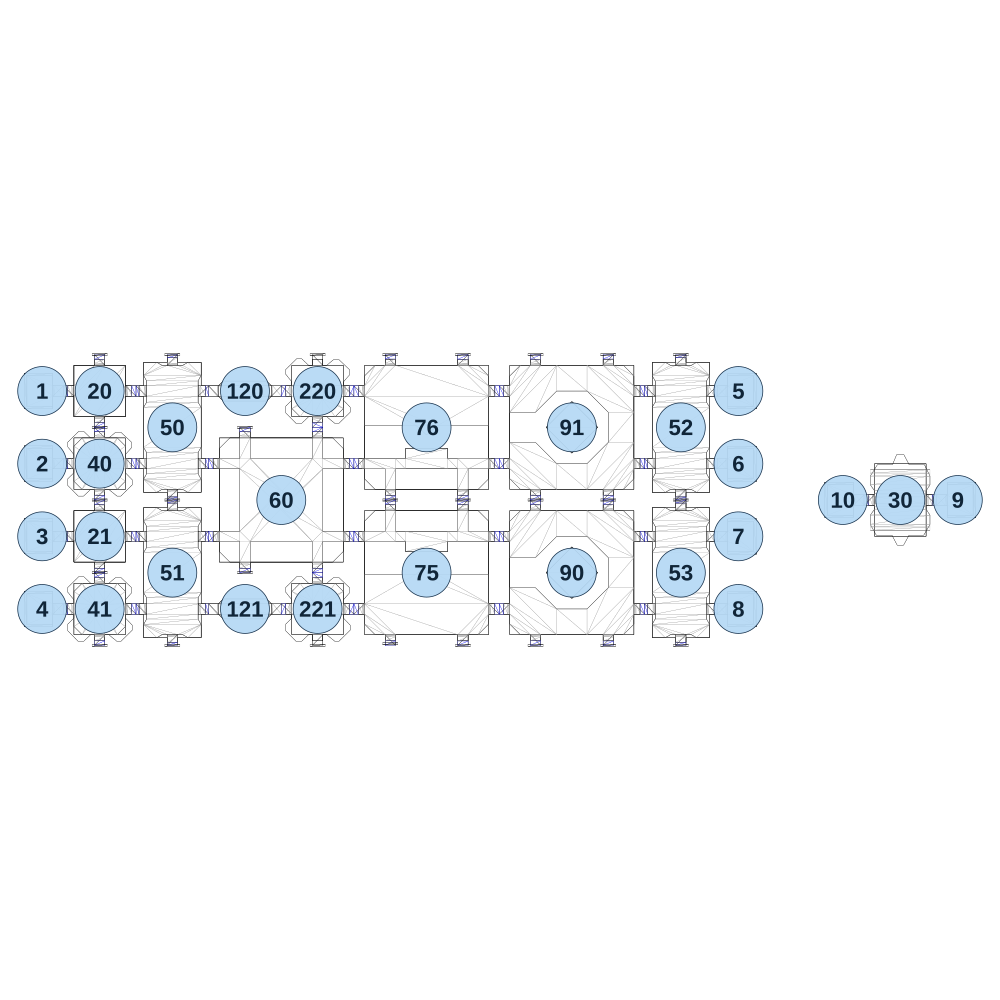

# map_machine01_05

[All map wireframes](README.md)

[SVG](map_machine01_05.svg) · [PNG](map_machine01_05.png) · [Geometry JSON](map_machine01_05.json)

## Section reference positions

These are markers, not room boundaries or safe spawn points. Positions use the file’s XYZ axes; the wireframe projects X/Z. Rotation is retained raw, not interpreted here.

| Section ID | X | Y | Z | Raw rotation |
|---:|---:|---:|---:|---:|
| 120 | -720 | 0 | -360 | 16383 |
| 121 | -720 | 0 | 360 | 16383 |
| 20 | -1200 | 0 | -360 | 0 |
| 21 | -1200 | 0 | 120 | 0 |
| 50 | -960 | 0 | -240 | 0 |
| 51 | -960 | 0 | 240 | 0 |
| 52 | 720 | 0 | -240 | 0 |
| 53 | 720 | 0 | 240 | 0 |
| 60 | -600 | 0 | 0 | 0 |
| 75 | -120 | 0 | 240 | 32768 |
| 76 | -120 | 0 | -240 | 0 |
| 90 | 360 | 0 | 240 | 49152 |
| 91 | 360 | 0 | -240 | 49152 |
| 30 | 1445 | 0 | 0 | 16383 |
| 1 | -1390 | 0 | -360 | 49152 |
| 2 | -1390 | 0 | -120 | 49152 |
| 3 | -1390 | 0 | 120 | 49152 |
| 4 | -1390 | 0 | 360 | 49152 |
| 5 | 910 | 0 | -360 | 16383 |
| 6 | 910 | 0 | -120 | 16383 |
| 7 | 910 | 0 | 120 | 16383 |
| 8 | 910 | 0 | 360 | 16383 |
| 9 | 1635 | 0 | 0 | 16383 |
| 10 | 1255 | 0 | 0 | 49152 |
| 40 | -1200 | 0 | -120 | 0 |
| 41 | -1200 | 0 | 360 | 0 |
| 220 | -480 | 0 | -360 | 0 |
| 221 | -480 | 0 | 360 | 32768 |

Collision triangles: 5742. Sentinel/unlabelled records remain in JSON. Overlapping marker positions are preserved, not moved to invent room locations.
