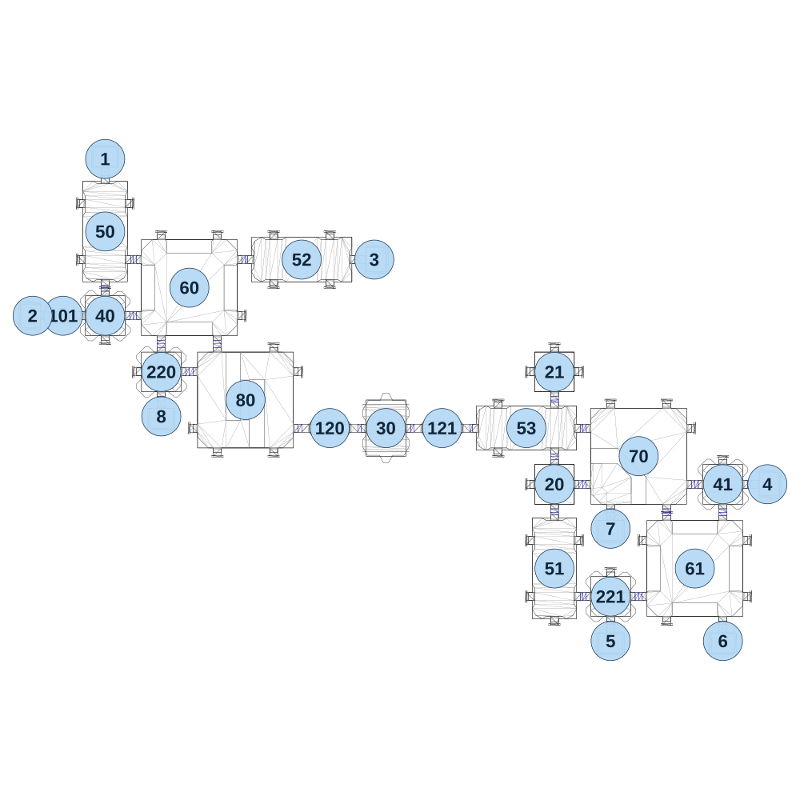

# map_machine02_00

[All map wireframes](README.md)

[SVG](map_machine02_00.svg) · [PNG](map_machine02_00.png) · [Geometry JSON](map_machine02_00.json)

## Section reference positions

These are markers, not room boundaries or safe spawn points. Positions use the file’s XYZ axes; the wireframe projects X/Z. Rotation is retained raw, not interpreted here.

| Section ID | X | Y | Z | Raw rotation |
|---:|---:|---:|---:|---:|
| 101 | -180 | 0 | 670 | 16383 |
| 120 | 960 | 0 | 1150 | 16383 |
| 121 | 1440 | 0 | 1150 | 16383 |
| 20 | 1920 | 0 | 1390 | 0 |
| 21 | 1920 | 0 | 910 | 0 |
| 50 | 0 | 0 | 310 | 16383 |
| 51 | 1920 | 0 | 1750 | 16383 |
| 52 | 840 | 0 | 430 | 0 |
| 53 | 1800 | 0 | 1150 | 0 |
| 60 | 360 | 0 | 550 | 0 |
| 61 | 2520 | 0 | 1750 | 0 |
| 70 | 2280 | 0 | 1270 | 0 |
| 80 | 600 | 0 | 1030 | 16383 |
| 30 | 1200 | 0 | 1150 | 16383 |
| 1 | 0 | 0 | 0 | 32768 |
| 2 | -310 | 0 | 670 | 49152 |
| 3 | 1150 | 0 | 430 | 16383 |
| 4 | 2830 | 0 | 1390 | 16383 |
| 5 | 2160 | 0 | 2060 | 0 |
| 6 | 2640 | 0 | 2060 | 0 |
| 7 | 2160 | 0 | 1580 | 0 |
| 8 | 240 | 0 | 1100 | 0 |
| 40 | 0 | 0 | 670 | 0 |
| 41 | 2640 | 0 | 1390 | 0 |
| 220 | 240 | 0 | 910 | 16383 |
| 221 | 2160 | 0 | 1870 | 0 |

Collision triangles: 5271. Sentinel/unlabelled records remain in JSON. Overlapping marker positions are preserved, not moved to invent room locations.
