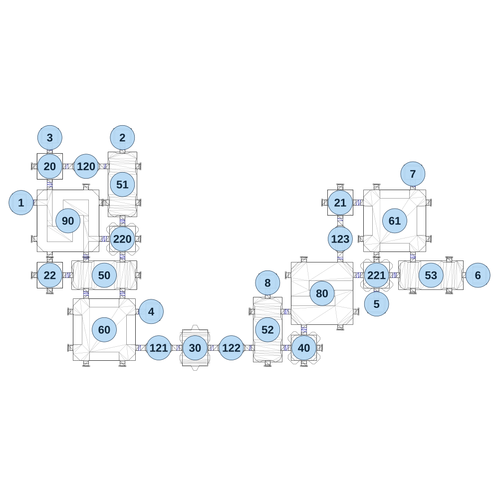

# map_machine02_01

[All map wireframes](README.md)

[SVG](map_machine02_01.svg) · [PNG](map_machine02_01.png) · [Geometry JSON](map_machine02_01.json)

## Section reference positions

These are markers, not room boundaries or safe spawn points. Positions use the file’s XYZ axes; the wireframe projects X/Z. Rotation is retained raw, not interpreted here.

| Section ID | X | Y | Z | Raw rotation |
|---:|---:|---:|---:|---:|
| 120 | 240 | 0 | 190 | 16383 |
| 121 | 720 | 0 | 1390 | 16383 |
| 122 | 1200 | 0 | 1390 | 16383 |
| 123 | 1920 | 0 | 670 | 0 |
| 20 | 0 | 0 | 190 | 0 |
| 21 | 1920 | 0 | 430 | 0 |
| 22 | 0 | 0 | 910 | 0 |
| 50 | 360 | 0 | 910 | 0 |
| 51 | 480 | 0 | 310 | 16383 |
| 52 | 1440 | 0 | 1270 | 16383 |
| 53 | 2520 | 0 | 910 | 0 |
| 60 | 360 | 0 | 1270 | 0 |
| 61 | 2280 | 0 | 550 | 0 |
| 80 | 1800 | 0 | 1030 | 0 |
| 90 | 120 | 0 | 550 | 0 |
| 30 | 960 | 0 | 1390 | 16383 |
| 1 | -190 | 0 | 430 | 49152 |
| 2 | 480 | 0 | -1e-06 | 32768 |
| 3 | 0 | 0 | -1e-06 | 32768 |
| 4 | 670 | 0 | 1150 | 16383 |
| 5 | 2160 | 0 | 1100 | 0 |
| 6 | 2830 | 0 | 910 | 16383 |
| 7 | 2400 | 0 | 240 | 32768 |
| 8 | 1440 | 0 | 960 | 32768 |
| 40 | 1680 | 0 | 1390 | 0 |
| 220 | 480 | 0 | 670 | 49152 |
| 221 | 2160 | 0 | 910 | 0 |

Collision triangles: 5165. Sentinel/unlabelled records remain in JSON. Overlapping marker positions are preserved, not moved to invent room locations.
