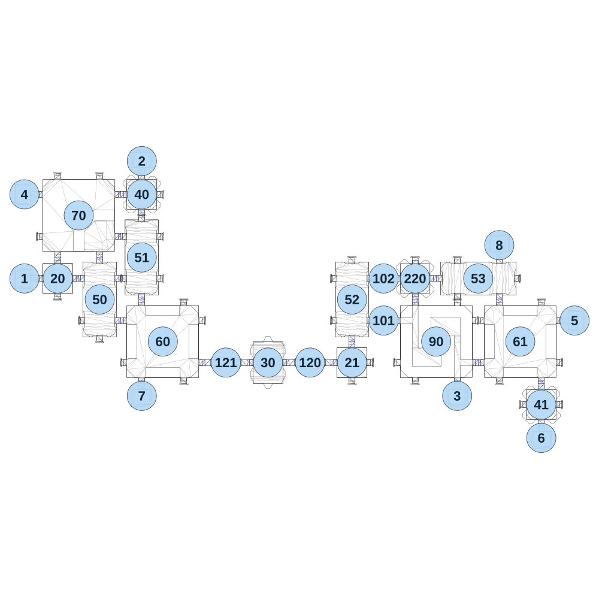

# map_machine02_02

[All map wireframes](README.md)

[SVG](map_machine02_02.svg) · [PNG](map_machine02_02.png) · [Geometry JSON](map_machine02_02.json)

## Section reference positions

These are markers, not room boundaries or safe spawn points. Positions use the file’s XYZ axes; the wireframe projects X/Z. Rotation is retained raw, not interpreted here.

| Section ID | X | Y | Z | Raw rotation |
|---:|---:|---:|---:|---:|
| 101 | 2050 | 0 | 720 | 16383 |
| 102 | 2050 | 0 | 480 | 16383 |
| 120 | 1630 | 0 | 960 | 16383 |
| 121 | 1150 | 0 | 960 | 16383 |
| 20 | 190 | 0 | 480 | 0 |
| 21 | 1870 | 0 | 960 | 0 |
| 50 | 430 | 0 | 600 | 16383 |
| 51 | 670 | 0 | 360 | 16383 |
| 52 | 1870 | 0 | 600 | 16383 |
| 53 | 2590 | 0 | 480 | 0 |
| 60 | 790 | 0 | 840 | 0 |
| 61 | 2830 | 0 | 840 | 0 |
| 70 | 310 | 0 | 120 | 16383 |
| 90 | 2350 | 0 | 840 | 0 |
| 30 | 1390 | 0 | 960 | 16383 |
| 1 | 0 | 0 | 480 | 49152 |
| 2 | 670 | 0 | -190 | 32768 |
| 3 | 2470 | 0 | 1150 | 0 |
| 4 | 0 | 0 | 0 | 49152 |
| 5 | 3140 | 0 | 720 | 16383 |
| 6 | 2950 | 0 | 1390 | 0 |
| 7 | 670 | 0 | 1150 | 0 |
| 8 | 2710 | 0 | 290 | 32768 |
| 40 | 670 | 0 | -2e-06 | 0 |
| 41 | 2950 | 0 | 1200 | 0 |
| 220 | 2230 | 0 | 480 | 0 |

Collision triangles: 5006. Sentinel/unlabelled records remain in JSON. Overlapping marker positions are preserved, not moved to invent room locations.
