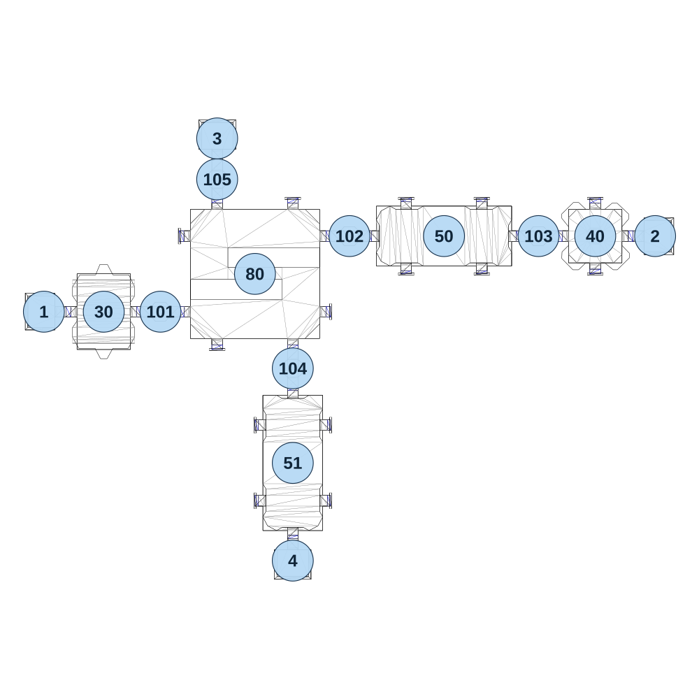

# map_machine02_03

[All map wireframes](README.md)

[SVG](map_machine02_03.svg) · [PNG](map_machine02_03.png) · [Geometry JSON](map_machine02_03.json)

## Section reference positions

These are markers, not room boundaries or safe spawn points. Positions use the file’s XYZ axes; the wireframe projects X/Z. Rotation is retained raw, not interpreted here.

| Section ID | X | Y | Z | Raw rotation |
|---:|---:|---:|---:|---:|
| 101 | -600 | 0 | 240 | 16383 |
| 102 | 0 | 0 | 0 | 16383 |
| 103 | 600 | 0 | 0 | 16383 |
| 104 | -180 | 0 | 420 | 0 |
| 105 | -420 | 0 | -180 | 0 |
| 50 | 300 | 0 | 0 | 0 |
| 51 | -180 | 0 | 720 | 16384 |
| 80 | -300 | 0 | 120 | 0 |
| 30 | -780 | 0 | 240 | 16383 |
| 1 | -970 | 0 | 240 | 49152 |
| 2 | 970 | 0 | 0 | 16383 |
| 3 | -420 | 0 | -310 | 32768 |
| 4 | -180 | 0 | 1030 | 0 |
| 40 | 780 | 0 | 0 | 0 |

Collision triangles: 2079. Sentinel/unlabelled records remain in JSON. Overlapping marker positions are preserved, not moved to invent room locations.
