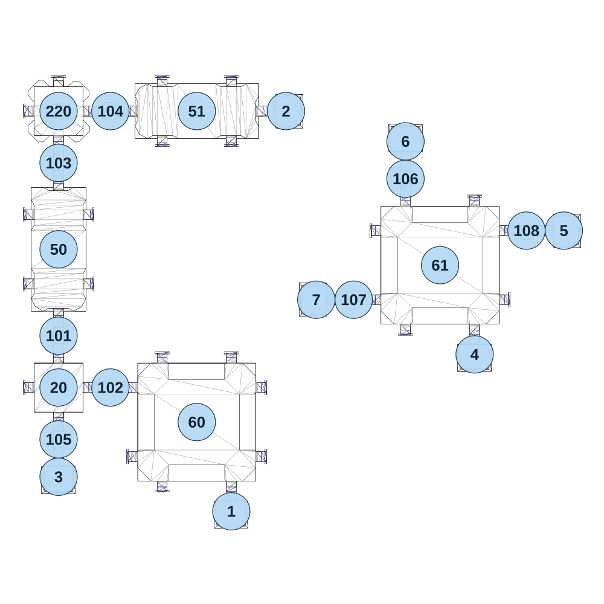

# map_machine02_04

[All map wireframes](README.md)

[SVG](map_machine02_04.svg) · [PNG](map_machine02_04.png) · [Geometry JSON](map_machine02_04.json)

## Section reference positions

These are markers, not room boundaries or safe spawn points. Positions use the file’s XYZ axes; the wireframe projects X/Z. Rotation is retained raw, not interpreted here.

| Section ID | X | Y | Z | Raw rotation |
|---:|---:|---:|---:|---:|
| 101 | -315 | 0 | 310 | 0 |
| 102 | -135 | 0 | 490 | 16383 |
| 103 | -315 | 0 | -290 | 0 |
| 104 | -135 | 0 | -470 | 16383 |
| 105 | -315 | 0 | 670 | 0 |
| 106 | 890 | 0 | -235 | 0 |
| 107 | 710 | 0 | 185 | 16384 |
| 108 | 1310 | 0 | -55 | 16384 |
| 20 | -315 | 0 | 490 | 0 |
| 50 | -315 | 0 | 10 | 16383 |
| 51 | 165 | 0 | -470 | 0 |
| 60 | 165 | 0 | 610 | 0 |
| 61 | 1010 | 0 | 65 | 0 |
| 1 | 285 | 0 | 920 | 0 |
| 2 | 475 | 0 | -470 | 16383 |
| 3 | -315 | 0 | 800 | 0 |
| 4 | 1130 | 0 | 375 | 0 |
| 5 | 1440 | 0 | -55 | 16384 |
| 6 | 890 | 0 | -365 | 32768 |
| 7 | 580 | 0 | 185 | 49152 |
| 220 | -315 | 0 | -470 | 0 |

Collision triangles: 2840. Sentinel/unlabelled records remain in JSON. Overlapping marker positions are preserved, not moved to invent room locations.
