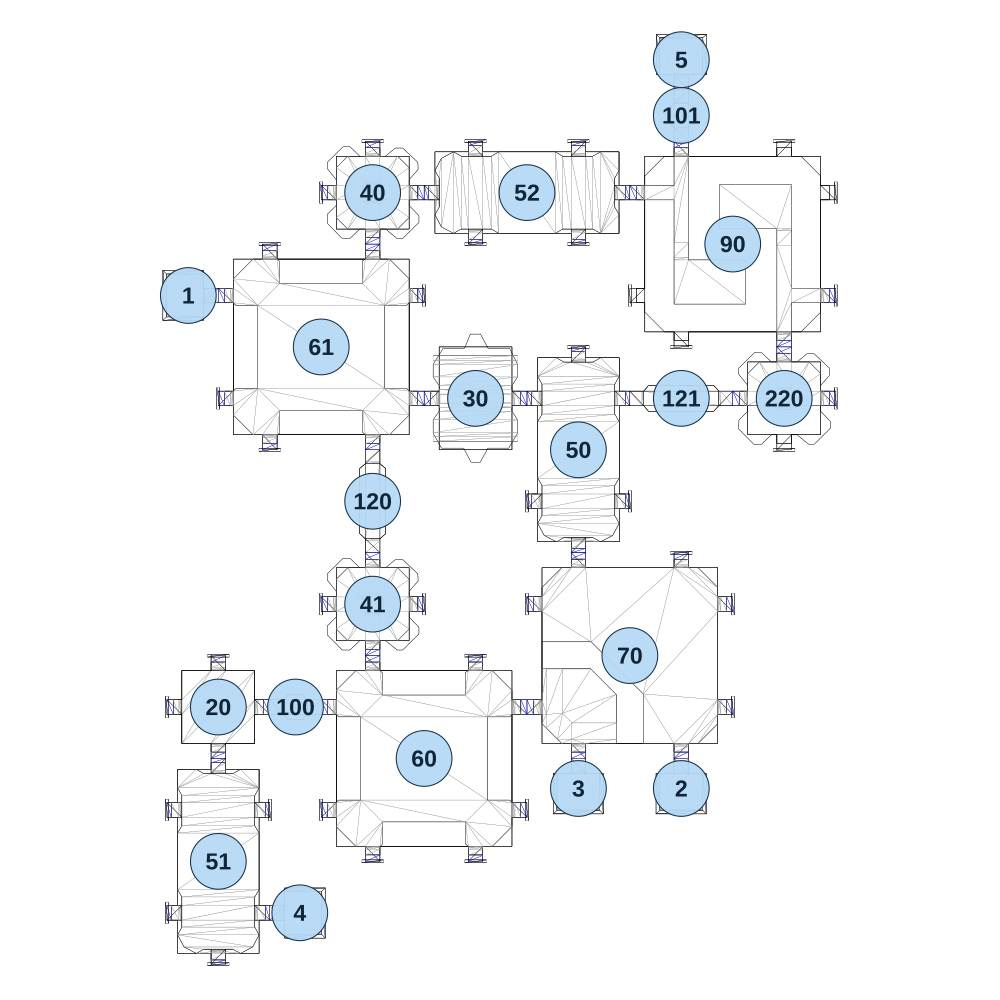

# map_machine02_05

[All map wireframes](README.md)

[SVG](map_machine02_05.svg) · [PNG](map_machine02_05.png) · [Geometry JSON](map_machine02_05.json)

## Section reference positions

These are markers, not room boundaries or safe spawn points. Positions use the file’s XYZ axes; the wireframe projects X/Z. Rotation is retained raw, not interpreted here.

| Section ID | X | Y | Z | Raw rotation |
|---:|---:|---:|---:|---:|
| 100 | -420 | 0 | 720 | 16383 |
| 101 | 480 | 0 | -660 | 0 |
| 120 | -240 | 0 | 240 | 0 |
| 121 | 480 | 0 | 0 | 16383 |
| 20 | -600 | 0 | 720 | 0 |
| 50 | 240 | 0 | 120 | 16383 |
| 51 | -600 | 0 | 1080 | 16383 |
| 52 | 120 | 0 | -480 | 0 |
| 60 | -120 | 0 | 840 | 0 |
| 61 | -360 | 0 | -120 | 0 |
| 70 | 360 | 0 | 600 | 0 |
| 90 | 600 | 0 | -360 | 0 |
| 30 | 0 | 0 | 0 | 16383 |
| 1 | -670 | 0 | -240 | 49152 |
| 2 | 480 | 0 | 910 | 0 |
| 3 | 240 | 0 | 910 | 0 |
| 4 | -410 | 0 | 1200 | 16383 |
| 5 | 480 | 0 | -790 | 32768 |
| 40 | -240 | 0 | -480 | 0 |
| 41 | -240 | 0 | 480 | 0 |
| 220 | 720 | 0 | 0 | 32768 |

Collision triangles: 4444. Sentinel/unlabelled records remain in JSON. Overlapping marker positions are preserved, not moved to invent room locations.
