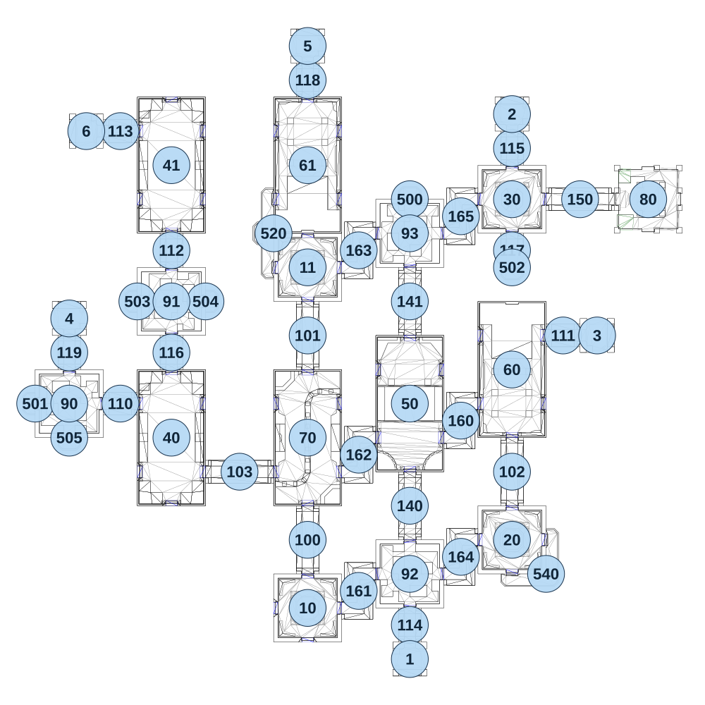

# map_ruins01_00

[All map wireframes](README.md)

[SVG](map_ruins01_00.svg) · [PNG](map_ruins01_00.png) · [Geometry JSON](map_ruins01_00.json)

## Section reference positions

These are markers, not room boundaries or safe spawn points. Positions use the file’s XYZ axes; the wireframe projects X/Z. Rotation is retained raw, not interpreted here.

| Section ID | X | Y | Z | Raw rotation |
|---:|---:|---:|---:|---:|
| 100 | -345 | 0 | 460 | 0 |
| 101 | -345 | 0 | -260 | 0 |
| 102 | 375 | 0 | 220 | 0 |
| 103 | -585 | 0 | 220 | 16383 |
| 110 | -1005 | 0 | -20 | 16383 |
| 111 | 555 | 0 | -260 | 16383 |
| 112 | -825 | 0 | -560 | 0 |
| 113 | -1005 | 0 | -980 | 16383 |
| 114 | 15 | 0 | 760 | 0 |
| 115 | 375 | 0 | -920 | 0 |
| 116 | -825 | 0 | -200 | 0 |
| 117 | 375 | 0 | -560 | 0 |
| 118 | -345 | 0 | -1160 | 0 |
| 119 | -1185 | 0 | -200 | 0 |
| 140 | 15 | 0 | 340 | 0 |
| 141 | 15 | 0 | -380 | 0 |
| 150 | 615 | 0 | -740 | 16383 |
| 160 | 195 | 0 | 40 | 16383 |
| 161 | -165 | 0 | 640 | 16383 |
| 162 | -165 | 0 | 160 | 16383 |
| 163 | -165 | 0 | -560 | 16383 |
| 164 | 195 | 0 | 520 | 16383 |
| 165 | 195 | 0 | -680 | 16383 |
| 10 | -345 | 0 | 700 | 0 |
| 11 | -345 | 0 | -500 | 0 |
| 20 | 375 | 0 | 460 | 0 |
| 30 | 375 | 0 | -740 | 0 |
| 40 | -825 | 0 | 100 | 0 |
| 41 | -825 | 0 | -860 | 0 |
| 50 | 15 | 0 | -20 | 0 |
| 60 | 375 | 0 | -140 | 0 |
| 61 | -345 | 0 | -860 | 32768 |
| 70 | -345 | 0 | 100 | 0 |
| 1 | 15 | 0 | 880 | 32768 |
| 2 | 375 | 0 | -1040 | 0 |
| 3 | 675 | 0 | -260 | 49152 |
| 4 | -1185 | 0 | -320 | 0 |
| 5 | -345 | 0 | -1280 | 0 |
| 6 | -1125 | 0 | -980 | 16383 |
| 500 | 15 | 0 | -740 | 32768 |
| 501 | -1305 | 0 | -20 | 49152 |
| 502 | 375 | 0 | -500 | 0 |
| 503 | -945 | 0 | -380 | 49152 |
| 504 | -705 | 0 | -380 | 16383 |
| 505 | -1185 | 0 | 100 | 0 |
| 520 | -465 | 0 | -620 | 49152 |
| 540 | 495 | 0 | 580 | 0 |
| 80 | 855 | 0 | -740 | 49152 |
| 90 | -1185 | 0 | -20 | 49152 |
| 91 | -825 | 0 | -380 | 32768 |
| 92 | 15 | 0 | 580 | 16383 |
| 93 | 15 | 0 | -620 | 0 |

Collision triangles: 8798. Sentinel/unlabelled records remain in JSON. Overlapping marker positions are preserved, not moved to invent room locations.
