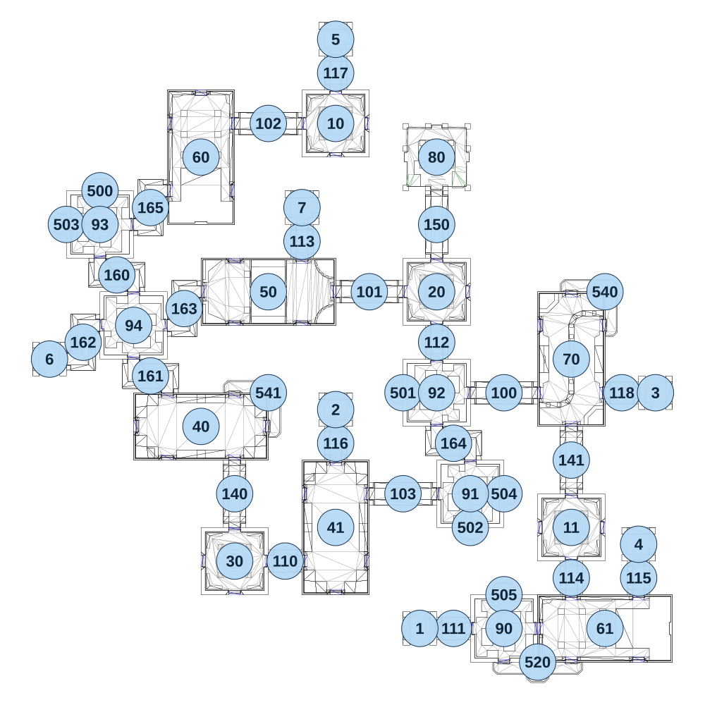

# map_ruins01_01

[All map wireframes](README.md)

[SVG](map_ruins01_01.svg) · [PNG](map_ruins01_01.png) · [Geometry JSON](map_ruins01_01.json)

## Section reference positions

These are markers, not room boundaries or safe spawn points. Positions use the file’s XYZ axes; the wireframe projects X/Z. Rotation is retained raw, not interpreted here.

| Section ID | X | Y | Z | Raw rotation |
|---:|---:|---:|---:|---:|
| 100 | 600 | 0 | -55 | 16383 |
| 101 | 120 | 0 | -415 | 16383 |
| 102 | -240 | 0 | -1015 | 16383 |
| 103 | 240 | 0 | 305 | 16383 |
| 110 | -180 | 0 | 545 | 16383 |
| 111 | 420 | 0 | 785 | 16383 |
| 112 | 360 | 0 | -235 | 0 |
| 113 | -120 | 0 | -595 | 0 |
| 114 | 840 | 0 | 605 | 0 |
| 115 | 1080 | 0 | 605 | 0 |
| 116 | 0 | 0 | 125 | 0 |
| 117 | 0 | 0 | -1195 | 0 |
| 118 | 1020 | 0 | -55 | 16383 |
| 140 | -360 | 0 | 305 | 0 |
| 141 | 840 | 0 | 185 | 0 |
| 150 | 360 | 0 | -655 | 0 |
| 160 | -780 | 0 | -475 | 0 |
| 161 | -660 | 0 | -115 | 0 |
| 162 | -900 | 0 | -235 | 16383 |
| 163 | -540 | 0 | -355 | 16383 |
| 164 | 420 | 0 | 125 | 0 |
| 165 | -660 | 0 | -715 | 16383 |
| 10 | 0 | 0 | -1015 | 0 |
| 11 | 840 | 0 | 425 | 0 |
| 20 | 360 | 0 | -415 | 0 |
| 30 | -360 | 0 | 545 | 16383 |
| 40 | -480 | 0 | 65 | 16383 |
| 41 | 0 | 0 | 425 | 0 |
| 50 | -240 | 0 | -415 | 16383 |
| 60 | -480 | 0 | -895 | 32768 |
| 61 | 960 | 0 | 785 | 49152 |
| 70 | 840 | 0 | -175 | 0 |
| 1 | 300 | 0 | 785 | 16383 |
| 2 | 0 | 0 | 5 | 0 |
| 3 | 1140 | 0 | -55 | 49152 |
| 4 | 1080 | 0 | 485 | 0 |
| 5 | 0 | 0 | -1315 | 0 |
| 6 | -1020 | 0 | -175 | 16383 |
| 7 | -120 | 0 | -715 | 0 |
| 500 | -840 | 0 | -775 | 32768 |
| 501 | 240 | 0 | -55 | 49152 |
| 502 | 480 | 0 | 425 | 0 |
| 503 | -960 | 0 | -655 | 49152 |
| 504 | 600 | 0 | 305 | 16383 |
| 505 | 600 | 0 | 665 | 32768 |
| 520 | 720 | 0 | 905 | 0 |
| 540 | 960 | 0 | -415 | 16383 |
| 541 | -240 | 0 | -55 | 16383 |
| 80 | 360 | 0 | -895 | 0 |
| 90 | 600 | 0 | 785 | 0 |
| 91 | 480 | 0 | 305 | 0 |
| 92 | 360 | 0 | -55 | 32768 |
| 93 | -840 | 0 | -655 | 0 |
| 94 | -720 | 0 | -295 | 16383 |

Collision triangles: 9125. Sentinel/unlabelled records remain in JSON. Overlapping marker positions are preserved, not moved to invent room locations.
