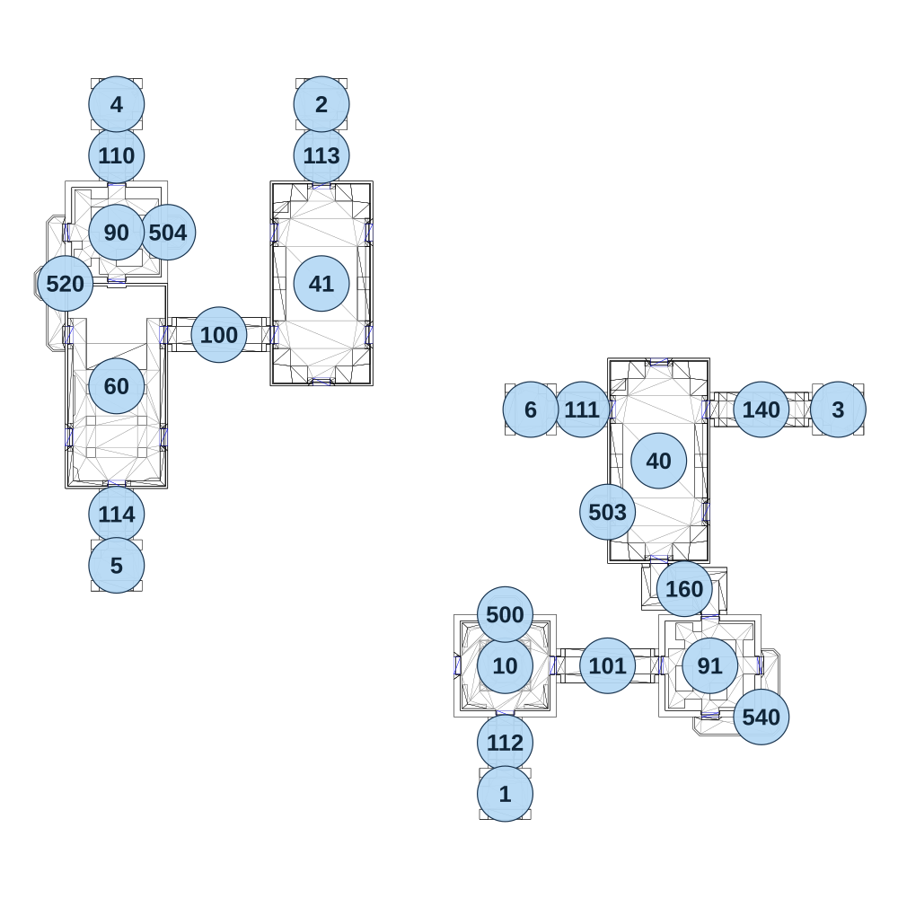

# map_ruins01_02

[All map wireframes](README.md)

[SVG](map_ruins01_02.svg) · [PNG](map_ruins01_02.png) · [Geometry JSON](map_ruins01_02.json)

## Section reference positions

These are markers, not room boundaries or safe spawn points. Positions use the file’s XYZ axes; the wireframe projects X/Z. Rotation is retained raw, not interpreted here.

| Section ID | X | Y | Z | Raw rotation |
|---:|---:|---:|---:|---:|
| 100 | -730 | 0 | -175 | 16383 |
| 101 | 180 | 0 | 600 | 16383 |
| 110 | -970 | 0 | -595 | 0 |
| 111 | 120 | 0 | 0 | 16383 |
| 112 | -60 | 0 | 780 | 0 |
| 113 | -490 | 0 | -595 | 0 |
| 114 | -970 | 0 | 245 | 0 |
| 140 | 540 | 0 | 0 | 16383 |
| 160 | 360 | 0 | 420 | 0 |
| 10 | -60 | 0 | 600 | 0 |
| 40 | 300 | 0 | 120 | 0 |
| 41 | -490 | 0 | -295 | 0 |
| 60 | -970 | 0 | -55 | 0 |
| 1 | -60 | 0 | 900 | 32768 |
| 2 | -490 | 0 | -715 | 0 |
| 3 | 720 | 0 | 0 | 49152 |
| 4 | -970 | 0 | -715 | 0 |
| 5 | -970 | 0 | 365 | 32768 |
| 6 | 0 | 0 | 0 | 16383 |
| 500 | -60 | 0 | 480 | 32768 |
| 503 | 180 | 0 | 240 | 49152 |
| 504 | -850 | 0 | -415 | 16383 |
| 520 | -1090 | 0 | -295 | 49152 |
| 540 | 540 | 0 | 720 | 0 |
| 90 | -970 | 0 | -415 | 16383 |
| 91 | 420 | 0 | 600 | 0 |

Collision triangles: 3923. Sentinel/unlabelled records remain in JSON. Overlapping marker positions are preserved, not moved to invent room locations.
