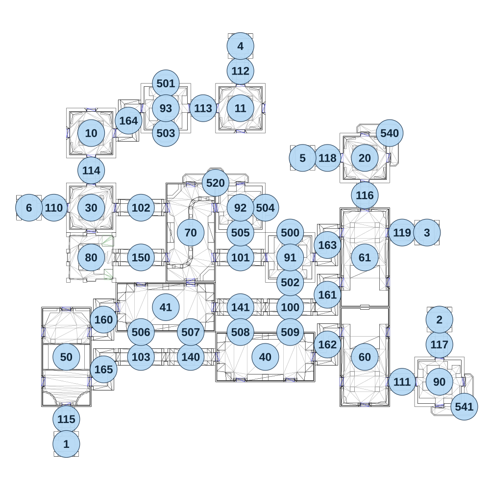

# map_ruins02_01

[All map wireframes](README.md)

[SVG](map_ruins02_01.svg) · [PNG](map_ruins02_01.png) · [Geometry JSON](map_ruins02_01.json)

## Section reference positions

These are markers, not room boundaries or safe spawn points. Positions use the file’s XYZ axes; the wireframe projects X/Z. Rotation is retained raw, not interpreted here.

| Section ID | X | Y | Z | Raw rotation |
|---:|---:|---:|---:|---:|
| 100 | 240 | 0 | 245 | 16383 |
| 101 | -0 | 0 | 5 | 16383 |
| 102 | -480 | 0 | -235 | 16383 |
| 103 | -480 | 0 | 485 | 16383 |
| 110 | -900 | 0 | -235 | 16383 |
| 111 | 780 | 0 | 605 | 16383 |
| 112 | -0 | 0 | -895 | 0 |
| 113 | -180 | 0 | -715 | 16383 |
| 114 | -720 | 0 | -415 | 0 |
| 115 | -840 | 0 | 785 | 0 |
| 116 | 600 | 0 | -295 | 0 |
| 117 | 960 | 0 | 425 | 0 |
| 118 | 420 | 0 | -475 | 16383 |
| 119 | 780 | 0 | -115 | 16383 |
| 140 | -240 | 0 | 485 | 16383 |
| 141 | -0 | 0 | 245 | 16383 |
| 150 | -480 | 0 | 5 | 16383 |
| 160 | -660 | 0 | 305 | 16383 |
| 161 | 420 | 0 | 185 | 16383 |
| 162 | 420 | 0 | 425 | 16383 |
| 163 | 420 | 0 | -55 | 16383 |
| 164 | -540 | 0 | -655 | 16383 |
| 165 | -660 | 0 | 545 | 16383 |
| 10 | -720 | 0 | -595 | 0 |
| 11 | -0 | 0 | -715 | 0 |
| 20 | 600 | 0 | -475 | 0 |
| 30 | -720 | 0 | -235 | 0 |
| 40 | 120 | 0 | 485 | 16383 |
| 41 | -360 | 0 | 245 | 16383 |
| 50 | -840 | 0 | 485 | 0 |
| 60 | 600 | 0 | 485 | 0 |
| 61 | 600 | 0 | 5 | 32768 |
| 70 | -240 | 0 | -115 | 0 |
| 1 | -840 | 0 | 905 | 32768 |
| 2 | 960 | 0 | 305 | 0 |
| 3 | 900 | 0 | -115 | 49152 |
| 4 | -0 | 0 | -1015 | 0 |
| 5 | 300 | 0 | -475 | 16383 |
| 6 | -1020 | 0 | -235 | 16383 |
| 500 | 240 | 0 | -115 | 32768 |
| 501 | -360 | 0 | -835 | 32768 |
| 502 | 240 | 0 | 125 | 0 |
| 503 | -360 | 0 | -595 | 0 |
| 504 | 120 | 0 | -235 | 16383 |
| 505 | -0 | 0 | -115 | 0 |
| 506 | -480 | 0 | 365 | 0 |
| 507 | -240 | 0 | 365 | 0 |
| 508 | -0 | 0 | 365 | 32768 |
| 509 | 240 | 0 | 365 | 32768 |
| 520 | -120 | 0 | -355 | 32768 |
| 540 | 720 | 0 | -595 | 16383 |
| 541 | 1080 | 0 | 725 | 0 |
| 80 | -720 | 0 | 5 | 16383 |
| 90 | 960 | 0 | 605 | 49152 |
| 91 | 240 | 0 | 5 | 32768 |
| 92 | -0 | 0 | -235 | 16383 |
| 93 | -360 | 0 | -715 | 0 |

Collision triangles: 8987. Sentinel/unlabelled records remain in JSON. Overlapping marker positions are preserved, not moved to invent room locations.
