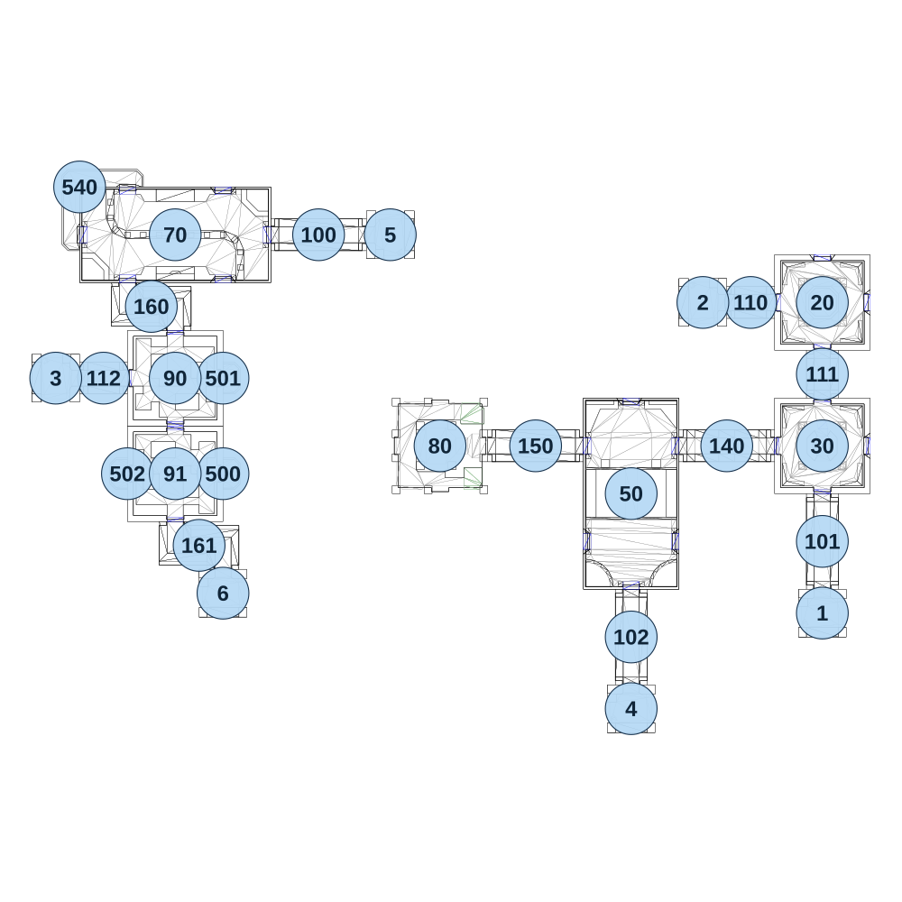

# map_ruins02_02

[All map wireframes](README.md)

[SVG](map_ruins02_02.svg) · [PNG](map_ruins02_02.png) · [Geometry JSON](map_ruins02_02.json)

## Section reference positions

These are markers, not room boundaries or safe spawn points. Positions use the file’s XYZ axes; the wireframe projects X/Z. Rotation is retained raw, not interpreted here.

| Section ID | X | Y | Z | Raw rotation |
|---:|---:|---:|---:|---:|
| 100 | -300 | 0 | -525 | 16383 |
| 101 | 965 | 0 | 245 | 0 |
| 102 | 485 | 0 | 485 | 0 |
| 110 | 785 | 0 | -355 | 16383 |
| 111 | 965 | 0 | -175 | 0 |
| 112 | -840 | 0 | -165 | 16383 |
| 140 | 725 | 0 | 5 | 16383 |
| 150 | 245 | 0 | 5 | 16383 |
| 160 | -720 | 0 | -345 | 0 |
| 161 | -600 | 0 | 255 | 0 |
| 20 | 965 | 0 | -355 | 0 |
| 30 | 965 | 0 | 5 | 32768 |
| 50 | 485 | 0 | 125 | 0 |
| 70 | -660 | 0 | -525 | 16383 |
| 1 | 965 | 0 | 425 | 32768 |
| 2 | 665 | 0 | -355 | 16383 |
| 3 | -960 | 0 | -165 | 16383 |
| 4 | 485 | 0 | 665 | 32768 |
| 5 | -120 | 0 | -525 | 49152 |
| 6 | -540 | 0 | 375 | 32768 |
| 500 | -540 | 0 | 75 | 16383 |
| 501 | -540 | 0 | -165 | 16383 |
| 502 | -780 | 0 | 75 | 49152 |
| 540 | -900 | 0 | -645 | 32768 |
| 80 | 5 | 0 | 5 | 16383 |
| 90 | -660 | 0 | -165 | 16383 |
| 91 | -660 | 0 | 75 | 49152 |

Collision triangles: 4280. Sentinel/unlabelled records remain in JSON. Overlapping marker positions are preserved, not moved to invent room locations.
