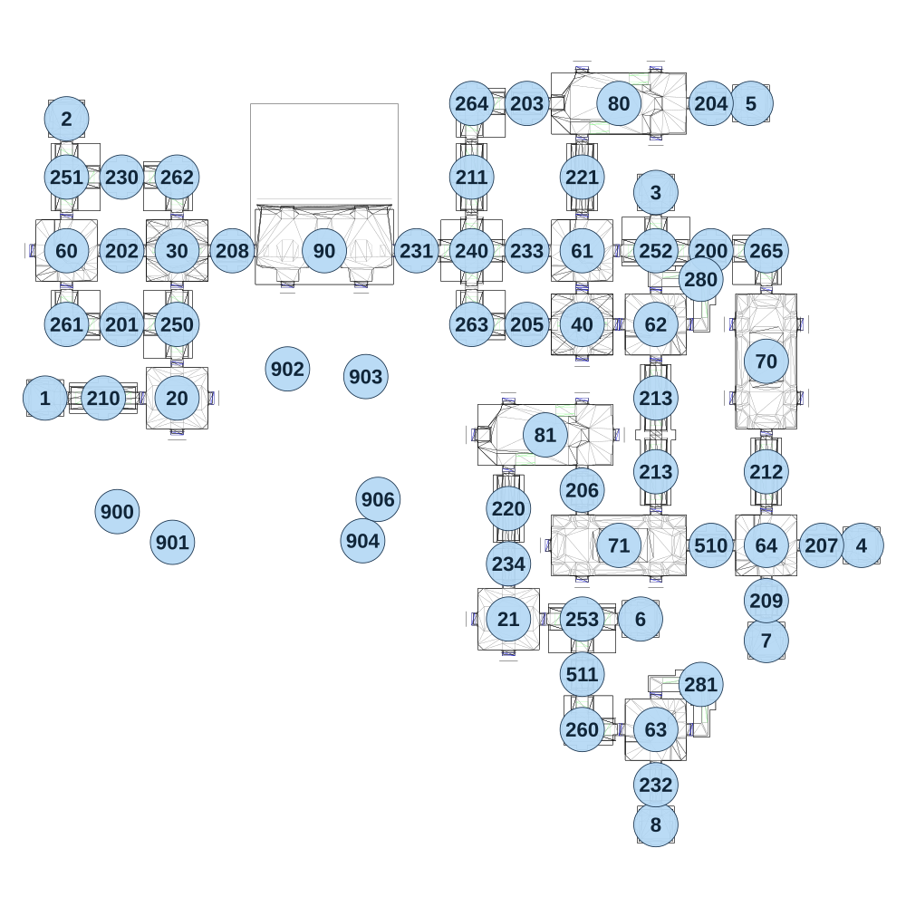

# map_seabed01_00

[All map wireframes](README.md)

[SVG](map_seabed01_00.svg) · [PNG](map_seabed01_00.png) · [Geometry JSON](map_seabed01_00.json)

## Section reference positions

These are markers, not room boundaries or safe spawn points. Positions use the file’s XYZ axes; the wireframe projects X/Z. Rotation is retained raw, not interpreted here.

| Section ID | X | Y | Z | Raw rotation |
|---:|---:|---:|---:|---:|
| 1 | -910 | 0 | 480 | 49152 |
| 2 | -840 | 30 | -430 | 32768 |
| 3 | 1080 | 0 | -190 | 32768 |
| 4 | 1750 | 0 | 960 | 16383 |
| 5 | 1390 | 0 | -480 | 16383 |
| 6 | 1030 | -60 | 1200 | 16383 |
| 7 | 1440 | -30 | 1270 | 0 |
| 8 | 1080 | -120 | 1870 | 0 |
| 20 | -480 | 0 | 480 | 0 |
| 21 | 600 | -60 | 1200 | 0 |
| 30 | -480 | 0 | -0 | 0 |
| 40 | 840 | -30 | 240 | 32768 |
| 60 | -840 | 0 | 0 | 0 |
| 61 | 840 | -30 | 0 | 0 |
| 62 | 1080 | -30 | 240 | 16383 |
| 63 | 1080 | -90 | 1560 | 16383 |
| 64 | 1440 | -30 | 960 | 0 |
| 90 | -0 | 30 | -0 | 0 |
| 70 | 1440 | 0 | 360 | 16383 |
| 71 | 960 | -30 | 960 | 0 |
| 80 | 960 | 0 | -480 | 0 |
| 81 | 720 | -30 | 600 | 0 |
| 200 | 1260 | 0 | -0 | 16383 |
| 201 | -660 | 0 | 240 | 16383 |
| 202 | -660 | 30 | -0 | 16383 |
| 203 | 660 | 0 | -480 | 16383 |
| 204 | 1260 | 0 | -480 | 16383 |
| 205 | 660 | 0 | 240 | 16383 |
| 206 | 840 | -30 | 780 | 0 |
| 207 | 1620 | 0 | 960 | 16383 |
| 208 | -300 | 30 | 0 | 16383 |
| 209 | 1440 | -30 | 1140 | 0 |
| 510 | 1260 | -30 | 960 | 16383 |
| 511 | 840 | -60 | 1380 | 0 |
| 210 | -720 | 0 | 480 | 16383 |
| 211 | 480 | 0 | -240 | 0 |
| 212 | 1440 | 0 | 720 | 0 |
| 213 | 1080 | -30 | 480 | 0 |
| 213 | 1080 | -30 | 720 | 0 |
| 240 | 480 | 0 | -0 | 0 |
| 280 | 1227 | -30 | 93 | 49152 |
| 281 | 1227 | -90 | 1413 | 49152 |
| 220 | 600 | -30 | 840 | 0 |
| 221 | 840 | 0 | -240 | 0 |
| 260 | 840 | -60 | 1560 | 16383 |
| 261 | -840 | 0 | 240 | 16383 |
| 262 | -480 | 0 | -240 | 49152 |
| 263 | 480 | 0 | 240 | 16383 |
| 264 | 480 | 0 | -480 | 0 |
| 265 | 1440 | 0 | 0 | 49152 |
| 250 | -480 | 0 | 240 | 49152 |
| 251 | -840 | 30 | -240 | 16383 |
| 252 | 1080 | 0 | -0 | 32768 |
| 253 | 840 | -60 | 1200 | 0 |
| 230 | -660 | 0 | -240 | 16383 |
| 231 | 300 | 0 | 0 | 16383 |
| 232 | 1080 | -120 | 1740 | 0 |
| 233 | 660 | -30 | -0 | 16383 |
| 234 | 600 | -60 | 1020 | 0 |
| 900 | -675 | -400 | 850 | 0 |
| 901 | -495 | -350 | 950 | 49152 |
| 902 | -120 | -400 | 385 | 16383 |
| 903 | 135 | -350 | 410 | 0 |
| 904 | 125 | -350 | 945 | 0 |
| 906 | 175 | -400 | 810 | 49152 |

Collision triangles: 11204. Sentinel/unlabelled records remain in JSON. Overlapping marker positions are preserved, not moved to invent room locations.
