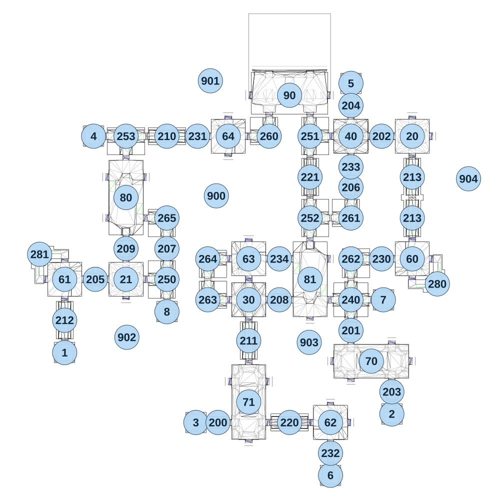

# map_seabed01_01

[All map wireframes](README.md)

[SVG](map_seabed01_01.svg) · [PNG](map_seabed01_01.png) · [Geometry JSON](map_seabed01_01.json)

## Section reference positions

These are markers, not room boundaries or safe spawn points. Positions use the file’s XYZ axes; the wireframe projects X/Z. Rotation is retained raw, not interpreted here.

| Section ID | X | Y | Z | Raw rotation |
|---:|---:|---:|---:|---:|
| 1 | -1160 | 0 | 635 | 0 |
| 2 | 760 | -90 | 995 | 0 |
| 3 | -390 | -60 | 1045 | 49152 |
| 4 | -990 | -30 | -635 | 49152 |
| 5 | 520 | -120 | -945 | 32768 |
| 6 | 400 | -120 | 1355 | 0 |
| 7 | 710 | -90 | 325 | 16383 |
| 8 | -560 | -30 | 395 | 0 |
| 20 | 880 | -90 | -635 | 0 |
| 21 | -800 | -30 | 205 | 0 |
| 30 | -80 | -90 | 325 | 16383 |
| 40 | 520 | -120 | -635 | 32768 |
| 60 | 880 | -120 | 85 | 0 |
| 61 | -1160 | -30 | 205 | 32768 |
| 62 | 400 | -90 | 1045 | 16383 |
| 63 | -80 | -90 | 85 | 49152 |
| 64 | -200 | -90 | -635 | 32768 |
| 90 | 160 | -90 | -875 | 0 |
| 70 | 640 | -90 | 685 | 0 |
| 71 | -80 | -60 | 925 | 16383 |
| 80 | -800 | -30 | -275 | 16383 |
| 81 | 280 | -90 | 205 | 49152 |
| 200 | -260 | -60 | 1045 | 16383 |
| 201 | 520 | -90 | 505 | 0 |
| 202 | 700 | -90 | -635 | 16383 |
| 203 | 760 | -90 | 865 | 0 |
| 204 | 520 | -120 | -815 | 0 |
| 205 | -980 | -30 | 205 | 16383 |
| 206 | 520 | -90 | -335 | 0 |
| 207 | -560 | -30 | 25 | 0 |
| 208 | 100 | -90 | 325 | 16383 |
| 209 | -800 | -30 | 25 | 0 |
| 210 | -560 | -30 | -635 | 16383 |
| 211 | -80 | -60 | 565 | 0 |
| 212 | -1160 | 0 | 445 | 0 |
| 213 | 880 | -90 | -155 | 0 |
| 213 | 880 | -90 | -395 | 0 |
| 240 | 520 | -90 | 325 | 0 |
| 280 | 1027 | -120 | 232 | 32768 |
| 281 | -1307 | -30 | 58 | 0 |
| 220 | 160 | -60 | 1045 | 16383 |
| 221 | 280 | -90 | -395 | 0 |
| 260 | 40 | -90 | -635 | 32768 |
| 261 | 520 | -90 | -155 | 32768 |
| 262 | 520 | -90 | 85 | 0 |
| 263 | -320 | -90 | 325 | 16383 |
| 264 | -320 | -90 | 85 | 0 |
| 265 | -560 | -30 | -155 | 49152 |
| 250 | -560 | -30 | 205 | 49152 |
| 251 | 280 | -90 | -635 | 16383 |
| 252 | 280 | -90 | -155 | 16383 |
| 253 | -800 | -30 | -635 | 0 |
| 230 | 700 | -120 | 85 | 16383 |
| 231 | -380 | -60 | -635 | 16383 |
| 232 | 400 | -120 | 1225 | 0 |
| 233 | 520 | -120 | -455 | 32768 |
| 234 | 100 | -90 | 85 | 16383 |
| 900 | -270 | -250 | -285 | 0 |
| 901 | -305 | -300 | -960 | 0 |
| 902 | -795 | -200 | 545 | 0 |
| 903 | 275 | -250 | 575 | 0 |
| 904 | 1210 | -200 | -385 | 0 |

Collision triangles: 10924. Sentinel/unlabelled records remain in JSON. Overlapping marker positions are preserved, not moved to invent room locations.
