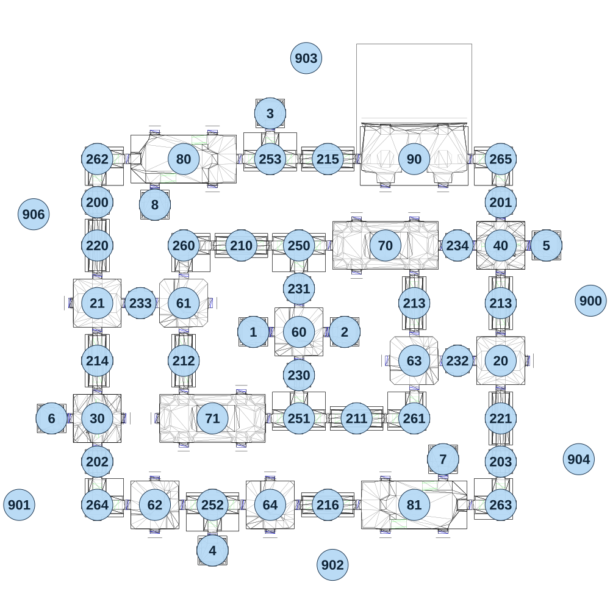

# map_seabed01_02

[All map wireframes](README.md)

[SVG](map_seabed01_02.svg) · [PNG](map_seabed01_02.png) · [Geometry JSON](map_seabed01_02.json)

## Section reference positions

These are markers, not room boundaries or safe spawn points. Positions use the file’s XYZ axes; the wireframe projects X/Z. Rotation is retained raw, not interpreted here.

| Section ID | X | Y | Z | Raw rotation |
|---:|---:|---:|---:|---:|
| 1 | -185 | 0 | 1e-06 | 49152 |
| 2 | 195 | 30 | 1e-06 | 16384 |
| 3 | -115 | -60 | -910 | 32768 |
| 4 | -355 | -90 | 910 | 0 |
| 5 | 1035 | -30 | -360 | 16383 |
| 6 | -1025 | -90 | 360 | 49152 |
| 7 | 605 | -60 | 530 | 32768 |
| 8 | -595 | -60 | -530 | 0 |
| 20 | 845 | -60 | 120 | 0 |
| 21 | -835 | -60 | -120 | 0 |
| 30 | -835 | -90 | 360 | 16384 |
| 40 | 845 | -60 | -360 | 32768 |
| 60 | 5 | 0 | 1e-06 | 0 |
| 61 | -475 | -30 | -120 | 0 |
| 62 | -595 | -90 | 720 | 16383 |
| 63 | 485 | -30 | 120 | 16383 |
| 64 | -115 | -90 | 720 | 0 |
| 90 | 485 | -60 | -720 | 0 |
| 70 | 365 | 0 | -360 | 0 |
| 71 | -355 | -30 | 360 | 0 |
| 80 | -475 | -60 | -720 | 0 |
| 81 | 485 | -60 | 720 | 32768 |
| 200 | -835 | -60 | -540 | 0 |
| 201 | 845 | -60 | -540 | 0 |
| 202 | -835 | -60 | 540 | 0 |
| 203 | 845 | -60 | 540 | 0 |
| 210 | -235 | 0 | -360 | 16384 |
| 211 | 245 | -30 | 360 | 16384 |
| 212 | -475 | -30 | 120 | 0 |
| 213 | 485 | 0 | -120 | 0 |
| 213 | 845 | -60 | -120 | 0 |
| 214 | -835 | -60 | 120 | 0 |
| 215 | 125 | -60 | -720 | 16384 |
| 216 | 125 | -60 | 720 | 16384 |
| 220 | -835 | -60 | -360 | 0 |
| 221 | 845 | -60 | 360 | 0 |
| 260 | -475 | 0 | -360 | 0 |
| 261 | 485 | -30 | 360 | 32768 |
| 262 | -835 | -60 | -720 | 0 |
| 263 | 845 | -60 | 720 | 32768 |
| 264 | -835 | -60 | 720 | 16384 |
| 265 | 845 | -60 | -720 | 49152 |
| 250 | 5 | 0 | -360 | 0 |
| 251 | 5 | -30 | 360 | 32768 |
| 252 | -355 | -90 | 720 | 0 |
| 253 | -115 | -60 | -720 | 32768 |
| 230 | 5 | -30 | 180 | 0 |
| 231 | 5 | 0 | -180 | 32768 |
| 232 | 665 | -60 | 120 | 16384 |
| 233 | -655 | -60 | -120 | 49152 |
| 234 | 665 | -30 | -360 | 16384 |
| 900 | 1220 | -200 | -130 | 0 |
| 901 | -1160 | -250 | 720 | 49152 |
| 902 | 145 | -300 | 970 | 16383 |
| 903 | 35 | -300 | -1140 | 0 |
| 904 | 1170 | -300 | 530 | 0 |
| 906 | -1100 | -300 | -490 | 49152 |

Collision triangles: 9916. Sentinel/unlabelled records remain in JSON. Overlapping marker positions are preserved, not moved to invent room locations.
