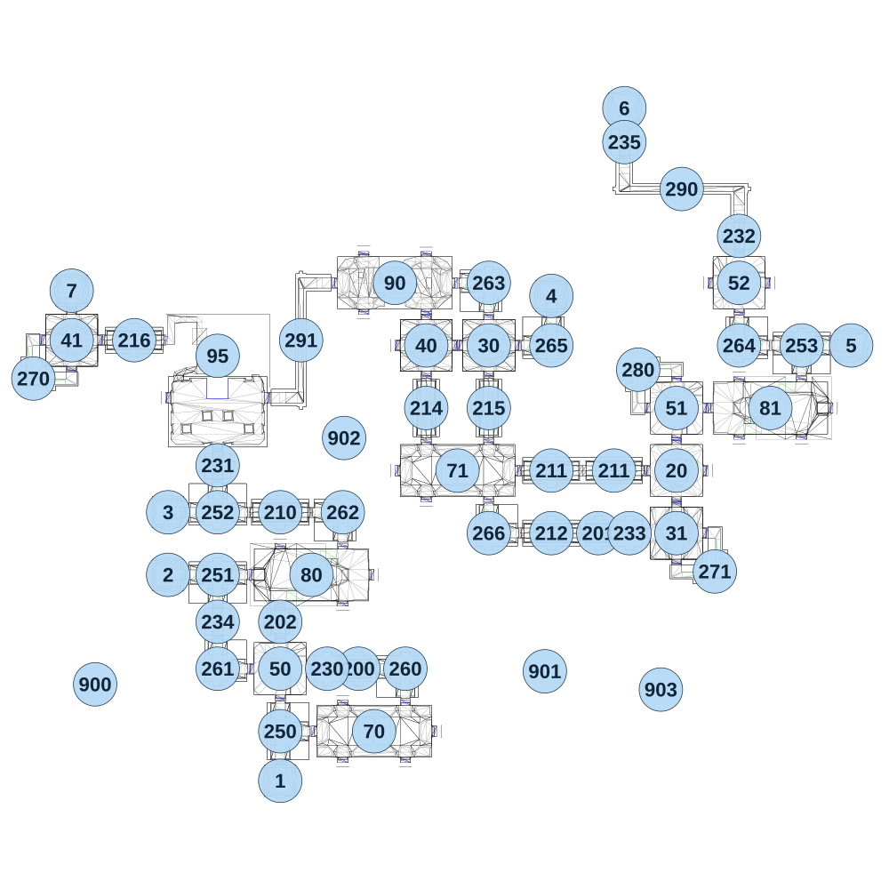

# map_seabed02_00

[All map wireframes](README.md)

[SVG](map_seabed02_00.svg) · [PNG](map_seabed02_00.png) · [Geometry JSON](map_seabed02_00.json)

## Section reference positions

These are markers, not room boundaries or safe spawn points. Positions use the file’s XYZ axes; the wireframe projects X/Z. Rotation is retained raw, not interpreted here.

| Section ID | X | Y | Z | Raw rotation |
|---:|---:|---:|---:|---:|
| 1 | -510 | 40 | 1190 | 0 |
| 2 | -940 | 10 | 400 | 49152 |
| 3 | -940 | 10 | 160 | 49152 |
| 4 | 530 | 10 | -670 | 32768 |
| 5 | 1680 | -50 | -480 | 16383 |
| 6 | 810 | -140 | -1390 | 32768 |
| 7 | -1310 | -50 | -690 | 32768 |
| 20 | 1010 | -20 | 0 | 0 |
| 30 | 290 | -20 | -480 | 0 |
| 31 | 1010 | -50 | 240 | 16383 |
| 40 | 50 | -20 | -480 | 32768 |
| 41 | -1310 | -50 | -500 | 32768 |
| 50 | -510 | 10 | 760 | 32768 |
| 51 | 1010 | -50 | -240 | 32768 |
| 52 | 1250 | -80 | -720 | 49152 |
| 95 | -750 | -20 | -440 | 0 |
| 70 | -150 | 40 | 1000 | 0 |
| 71 | 170 | -20 | 0 | 0 |
| 80 | -390 | 10 | 400 | 0 |
| 81 | 1370 | -50 | -240 | 32768 |
| 90 | -70 | -20 | -720 | 0 |
| 200 | -210 | 40 | 760 | 16383 |
| 201 | 710 | -20 | 240 | 16383 |
| 202 | -510 | 10 | 580 | 0 |
| 210 | -510 | 10 | 160 | 16383 |
| 211 | 530 | -20 | -0 | 16383 |
| 211 | 770 | -20 | 0 | 16383 |
| 212 | 530 | -20 | 240 | 16383 |
| 214 | 50 | -20 | -240 | 0 |
| 215 | 290 | -20 | -240 | 0 |
| 216 | -1070 | -20 | -500 | 16383 |
| 280 | 863 | -50 | -387 | 0 |
| 260 | -30 | 40 | 760 | 49152 |
| 261 | -750 | 40 | 760 | 16383 |
| 262 | -270 | 10 | 160 | 49152 |
| 263 | 290 | -20 | -720 | 49152 |
| 264 | 1250 | -50 | -480 | 16383 |
| 265 | 530 | 10 | -480 | 32768 |
| 266 | 290 | -20 | 240 | 16383 |
| 250 | -510 | 40 | 1000 | 16383 |
| 251 | -750 | 10 | 400 | 0 |
| 252 | -750 | 10 | 160 | 32768 |
| 253 | 1490 | -50 | -480 | 0 |
| 270 | -1457 | -50 | -353 | 16384 |
| 271 | 1157 | -50 | 387 | 32768 |
| 230 | -330 | 10 | 760 | 49152 |
| 231 | -750 | -20 | -20 | 32768 |
| 232 | 1250 | -110 | -900 | 32768 |
| 233 | 830 | -50 | 240 | 16383 |
| 234 | -750 | 10 | 580 | 32768 |
| 235 | 810 | -140 | -1260 | 32768 |
| 290 | 1030 | -110 | -1080 | 0 |
| 291 | -430 | -20 | -500 | 16383 |
| 900 | -1220 | -50 | 820 | 0 |
| 901 | 505 | 0 | 770 | 5461 |
| 902 | -265 | 100 | -125 | 10922 |
| 903 | 950 | -150 | 840 | 0 |

Collision triangles: 11163. Sentinel/unlabelled records remain in JSON. Overlapping marker positions are preserved, not moved to invent room locations.
