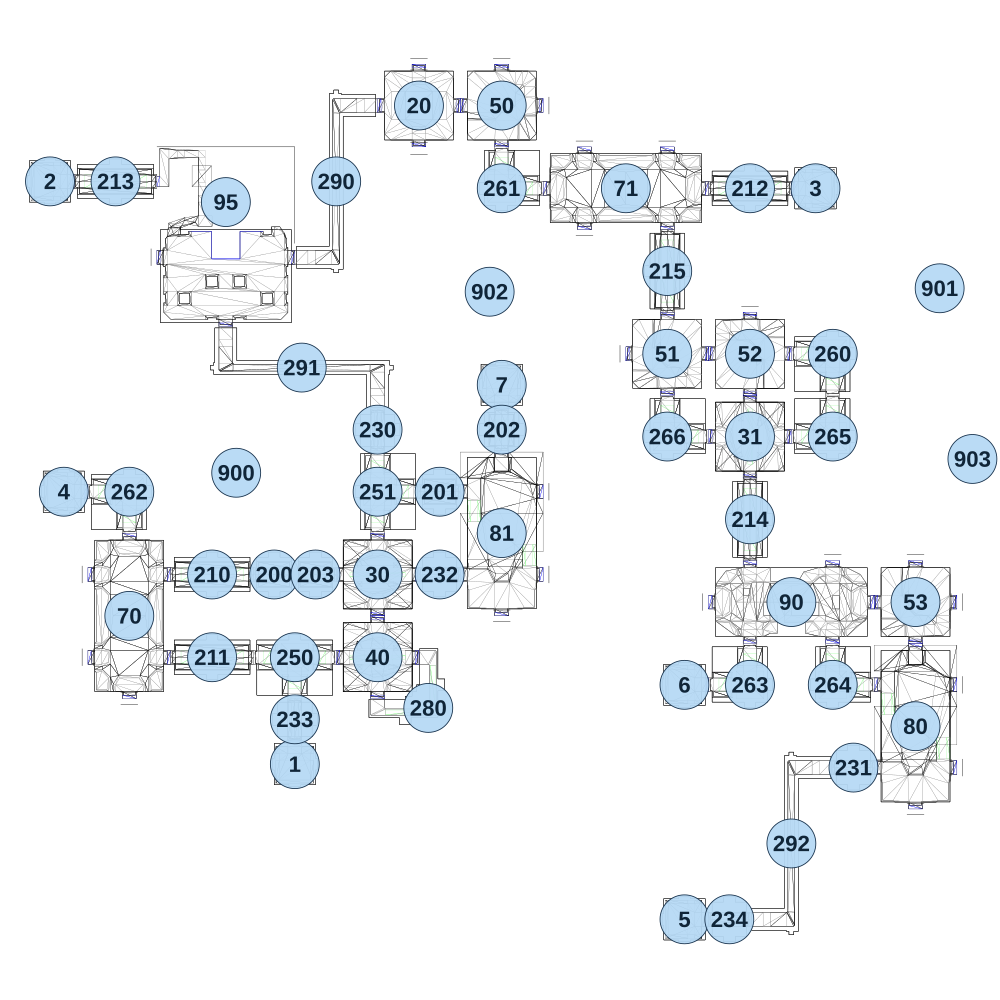

# map_seabed02_01

[All map wireframes](README.md)

[SVG](map_seabed02_01.svg) · [PNG](map_seabed02_01.png) · [Geometry JSON](map_seabed02_01.json)

## Section reference positions

These are markers, not room boundaries or safe spawn points. Positions use the file’s XYZ axes; the wireframe projects X/Z. Rotation is retained raw, not interpreted here.

| Section ID | X | Y | Z | Raw rotation |
|---:|---:|---:|---:|---:|
| 1 | -600 | 30 | 895 | 0 |
| 2 | -1310 | -60 | -795 | 49152 |
| 3 | 910 | -90 | -775 | 16383 |
| 4 | -1270 | 0 | 105 | 49152 |
| 5 | 530 | -150 | 1345 | 49152 |
| 6 | 530 | -90 | 665 | 49152 |
| 7 | 0 | -30 | -205 | 32768 |
| 20 | -240 | -60 | -1015 | 0 |
| 30 | -360 | -30 | 345 | 0 |
| 31 | 720 | -120 | -55 | 16383 |
| 40 | -360 | -30 | 585 | 0 |
| 50 | 0 | -90 | -1015 | 16383 |
| 51 | 480 | -120 | -295 | 0 |
| 52 | 720 | -120 | -295 | 32768 |
| 53 | 1200 | -90 | 425 | 0 |
| 95 | -800 | -60 | -735 | 0 |
| 70 | -1080 | 0 | 465 | 16383 |
| 71 | 360 | -90 | -775 | 0 |
| 80 | 1200 | -90 | 785 | 49152 |
| 81 | -0 | -30 | 225 | 49152 |
| 90 | 840 | -90 | 425 | 0 |
| 200 | -660 | 0 | 345 | 16383 |
| 201 | -180 | -30 | 105 | 16383 |
| 202 | -0 | -30 | -75 | 0 |
| 203 | -540 | 0 | 345 | 16383 |
| 210 | -840 | 0 | 345 | 16383 |
| 211 | -840 | 0 | 585 | 16383 |
| 212 | 720 | -90 | -775 | 16383 |
| 213 | -1120 | -60 | -795 | 16383 |
| 214 | 720 | -90 | 185 | 0 |
| 215 | 480 | -90 | -535 | 0 |
| 280 | -213 | -30 | 732 | 32768 |
| 260 | 960 | -120 | -295 | 49152 |
| 261 | 0 | -90 | -775 | 16383 |
| 262 | -1080 | 0 | 105 | 49152 |
| 263 | 720 | -90 | 665 | 32768 |
| 264 | 960 | -90 | 665 | 16383 |
| 265 | 960 | -120 | -55 | 32768 |
| 266 | 480 | -120 | -55 | 16383 |
| 250 | -600 | 0 | 585 | 0 |
| 251 | -360 | -30 | 105 | 16383 |
| 230 | -360 | -60 | -75 | 32768 |
| 231 | 1020 | -120 | 905 | 49152 |
| 232 | -180 | -30 | 345 | 16383 |
| 233 | -600 | 0 | 765 | 32768 |
| 234 | 660 | -150 | 1345 | 49152 |
| 290 | -480 | -60 | -795 | 16383 |
| 291 | -580 | -60 | -255 | 0 |
| 292 | 840 | -120 | 1125 | 16383 |
| 900 | -770 | -50 | 50 | 0 |
| 901 | 1270 | 0 | -485 | 5461 |
| 902 | -35 | 100 | -475 | 10922 |
| 903 | 1365 | -150 | 10 | 0 |

Collision triangles: 10506. Sentinel/unlabelled records remain in JSON. Overlapping marker positions are preserved, not moved to invent room locations.
