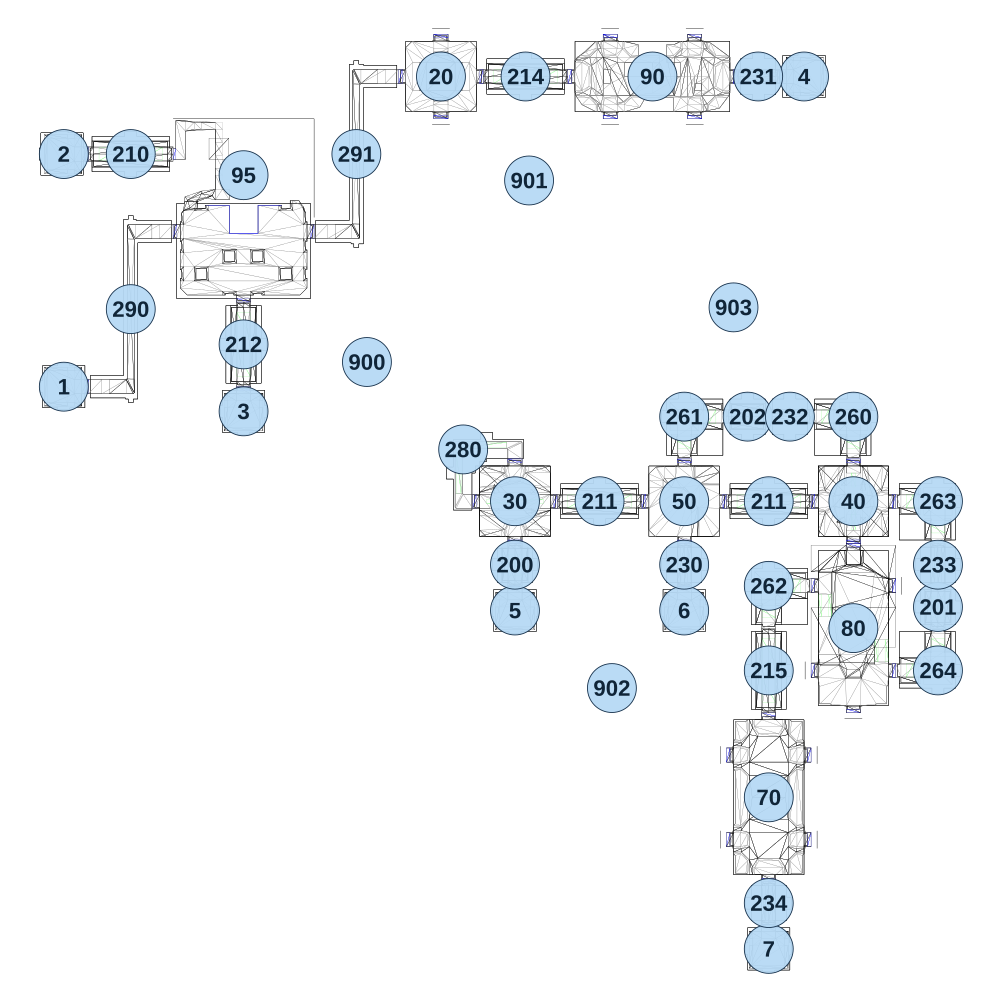

# map_seabed02_02

[All map wireframes](README.md)

[SVG](map_seabed02_02.svg) · [PNG](map_seabed02_02.png) · [Geometry JSON](map_seabed02_02.json)

## Section reference positions

These are markers, not room boundaries or safe spawn points. Positions use the file’s XYZ axes; the wireframe projects X/Z. Rotation is retained raw, not interpreted here.

| Section ID | X | Y | Z | Raw rotation |
|---:|---:|---:|---:|---:|
| 1 | -1460 | 0 | -325 | 49152 |
| 2 | -1460 | 0 | -985 | 49152 |
| 3 | -950 | 0 | -255 | 0 |
| 4 | 640 | -30 | -1205 | 16383 |
| 5 | -180 | 0 | 310 | 0 |
| 6 | 300 | 60 | 310 | 0 |
| 7 | 540 | 0 | 1270 | 0 |
| 20 | -390 | 0 | -1205 | 0 |
| 30 | -180 | 0 | 0 | 0 |
| 40 | 780 | 0 | 0 | 16383 |
| 50 | 300 | 0 | 0 | 32768 |
| 95 | -950 | 0 | -925 | 0 |
| 70 | 540 | 30 | 840 | 16383 |
| 80 | 780 | 30 | 360 | 49152 |
| 90 | 210 | 0 | -1205 | 32768 |
| 200 | -180 | 0 | 180 | 0 |
| 201 | 1020 | 30 | 300 | 0 |
| 202 | 480 | 0 | -240 | 16383 |
| 210 | -1270 | 0 | -985 | 16383 |
| 211 | 60 | 30 | 0 | 16383 |
| 211 | 540 | 0 | 0 | 16383 |
| 212 | -950 | 0 | -445 | 0 |
| 214 | -150 | 0 | -1205 | 16383 |
| 215 | 540 | 30 | 480 | 0 |
| 280 | -327 | 0 | -147 | 0 |
| 260 | 780 | 30 | -240 | 49152 |
| 261 | 300 | 0 | -240 | 0 |
| 262 | 540 | 30 | 240 | 0 |
| 263 | 1020 | 0 | 0 | 49152 |
| 264 | 1020 | 30 | 480 | 32768 |
| 230 | 300 | 30 | 180 | 32768 |
| 231 | 510 | -30 | -1205 | 16383 |
| 232 | 600 | 0 | -240 | 49152 |
| 233 | 1020 | 0 | 180 | 32768 |
| 234 | 540 | 0 | 1140 | 0 |
| 290 | -1270 | 0 | -545 | 16383 |
| 291 | -630 | 0 | -985 | 16383 |
| 900 | -600 | 0 | -395 | 0 |
| 901 | -140 | 0 | -910 | 5461 |
| 902 | 95 | 0 | 530 | 10922 |
| 903 | 440 | 0 | -550 | 0 |

Collision triangles: 7473. Sentinel/unlabelled records remain in JSON. Overlapping marker positions are preserved, not moved to invent room locations.
