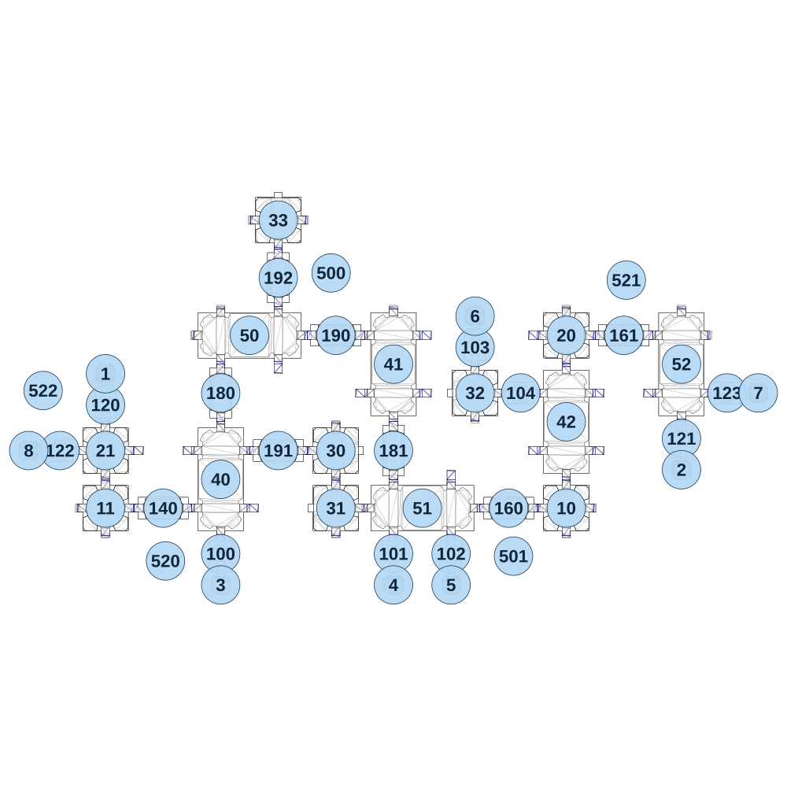

# map_space01_00

[All map wireframes](README.md)

[SVG](map_space01_00.svg) · [PNG](map_space01_00.png) · [Geometry JSON](map_space01_00.json)

## Section reference positions

These are markers, not room boundaries or safe spawn points. Positions use the file’s XYZ axes; the wireframe projects X/Z. Rotation is retained raw, not interpreted here.

| Section ID | X | Y | Z | Raw rotation |
|---:|---:|---:|---:|---:|
| 100 | -720 | 0 | 430 | 0 |
| 101 | 0 | 40 | 430 | 0 |
| 102 | 240 | 40 | 430 | 0 |
| 103 | 340 | 40 | -430 | 0 |
| 104 | 530 | 40 | -240 | 16383 |
| 120 | -1200 | 0 | -190 | 0 |
| 121 | 1200 | 40 | -50 | 0 |
| 122 | -1390 | 0 | -0 | 16383 |
| 123 | 1390 | 40 | -240 | 16383 |
| 140 | -960 | 0 | 240 | 16383 |
| 160 | 480 | 40 | 240 | 16383 |
| 161 | 960 | 40 | -480 | 16383 |
| 180 | -720 | 0 | -240 | 0 |
| 181 | 0 | 0 | -0 | 32768 |
| 190 | -240 | 0 | -480 | 16383 |
| 191 | -480 | 0 | -0 | 49152 |
| 192 | -480 | 40 | -720 | 0 |
| 1 | -1200 | 0 | -320 | 0 |
| 2 | 1200 | 40 | 80 | 32768 |
| 3 | -720 | 0 | 560 | 32768 |
| 4 | 0 | 40 | 560 | 32768 |
| 5 | 240 | 40 | 560 | 32768 |
| 6 | 340 | 40 | -560 | 0 |
| 7 | 1520 | 40 | -240 | 49152 |
| 8 | -1520 | 0 | -0 | 16383 |
| 10 | 720 | 40 | 240 | 0 |
| 11 | -1200 | 0 | 240 | 0 |
| 20 | 720 | 40 | -480 | 0 |
| 21 | -1200 | 0 | -0 | 0 |
| 30 | -240 | 40 | -0 | 49152 |
| 31 | -240 | 40 | 240 | 16383 |
| 32 | 340 | 40 | -240 | 16383 |
| 33 | -480 | 80 | -960 | 0 |
| 40 | -720 | 0 | 120 | 0 |
| 41 | 0 | 0 | -360 | 0 |
| 42 | 720 | 40 | -120 | 0 |
| 50 | -600 | 40 | -480 | 16383 |
| 51 | 120 | 40 | 240 | 16383 |
| 52 | 1200 | 40 | -360 | 0 |
| 500 | -260 | -100 | -740 | 23665 |
| 501 | 500 | -100 | 440 | 0 |
| 520 | -950 | -100 | 460 | 32768 |
| 521 | 970 | -100 | -710 | 0 |
| 522 | -1460 | -100 | -250 | 9102 |

Collision triangles: 8908. Sentinel/unlabelled records remain in JSON. Overlapping marker positions are preserved, not moved to invent room locations.
