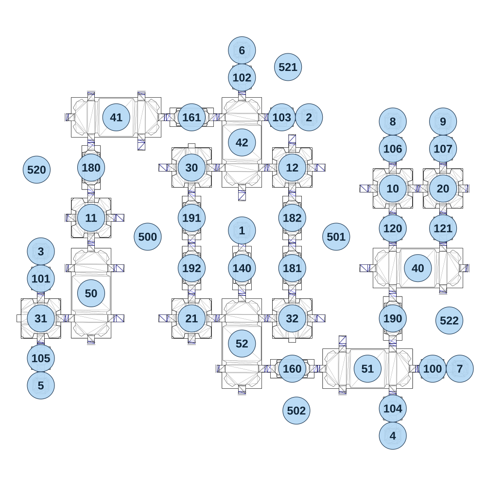

# map_space01_01

[All map wireframes](README.md)

[SVG](map_space01_01.svg) · [PNG](map_space01_01.png) · [Geometry JSON](map_space01_01.json)

## Section reference positions

These are markers, not room boundaries or safe spawn points. Positions use the file’s XYZ axes; the wireframe projects X/Z. Rotation is retained raw, not interpreted here.

| Section ID | X | Y | Z | Raw rotation |
|---:|---:|---:|---:|---:|
| 100 | 910 | 120 | 660 | 16383 |
| 101 | -960 | 0 | 230 | 0 |
| 102 | -0 | 40 | -730 | 0 |
| 103 | 190 | 40 | -540 | 16383 |
| 104 | 720 | 120 | 850 | 0 |
| 105 | -960 | 0 | 610 | 0 |
| 106 | 720 | 80 | -390 | 0 |
| 107 | 960 | 80 | -390 | 0 |
| 120 | 720 | 80 | -10 | 0 |
| 121 | 960 | 80 | -10 | 0 |
| 140 | 0 | 120 | 180 | 0 |
| 160 | 240 | 120 | 660 | 16383 |
| 161 | -240 | 40 | -540 | 16383 |
| 180 | -720 | 0 | -300 | 0 |
| 181 | 240 | 80 | 180 | 32768 |
| 182 | 240 | 40 | -60 | 32768 |
| 190 | 720 | 80 | 420 | 32768 |
| 191 | -240 | 40 | -60 | 32768 |
| 192 | -240 | 80 | 180 | 32768 |
| 1 | 0 | 120 | 0 | 0 |
| 2 | 320 | 40 | -540 | 49152 |
| 3 | -960 | 0 | 100 | 0 |
| 4 | 720 | 120 | 980 | 32768 |
| 5 | -960 | 0 | 740 | 32768 |
| 6 | -0 | 40 | -860 | 0 |
| 7 | 1040 | 120 | 660 | 49152 |
| 8 | 720 | 80 | -520 | 0 |
| 9 | 960 | 80 | -520 | 0 |
| 10 | 720 | 80 | -200 | 0 |
| 11 | -720 | 0 | -60 | 0 |
| 12 | 240 | 40 | -300 | 0 |
| 20 | 960 | 80 | -200 | 0 |
| 21 | -240 | 120 | 420 | 0 |
| 30 | -240 | 40 | -300 | 0 |
| 31 | -960 | 0 | 420 | 16383 |
| 32 | 240 | 120 | 420 | 32768 |
| 40 | 840 | 80 | 180 | 16383 |
| 41 | -600 | 40 | -540 | 16383 |
| 42 | 0 | 40 | -420 | 0 |
| 50 | -720 | 0 | 300 | 0 |
| 51 | 600 | 120 | 660 | 16383 |
| 52 | 0 | 120 | 540 | 0 |
| 500 | -450 | -100 | 30 | 16383 |
| 501 | 450 | -100 | 30 | 16383 |
| 502 | 260 | -100 | 860 | 0 |
| 520 | -980 | -100 | -290 | 16383 |
| 521 | 220 | -100 | -780 | 56433 |
| 522 | 990 | -100 | 430 | 49152 |

Collision triangles: 9348. Sentinel/unlabelled records remain in JSON. Overlapping marker positions are preserved, not moved to invent room locations.
