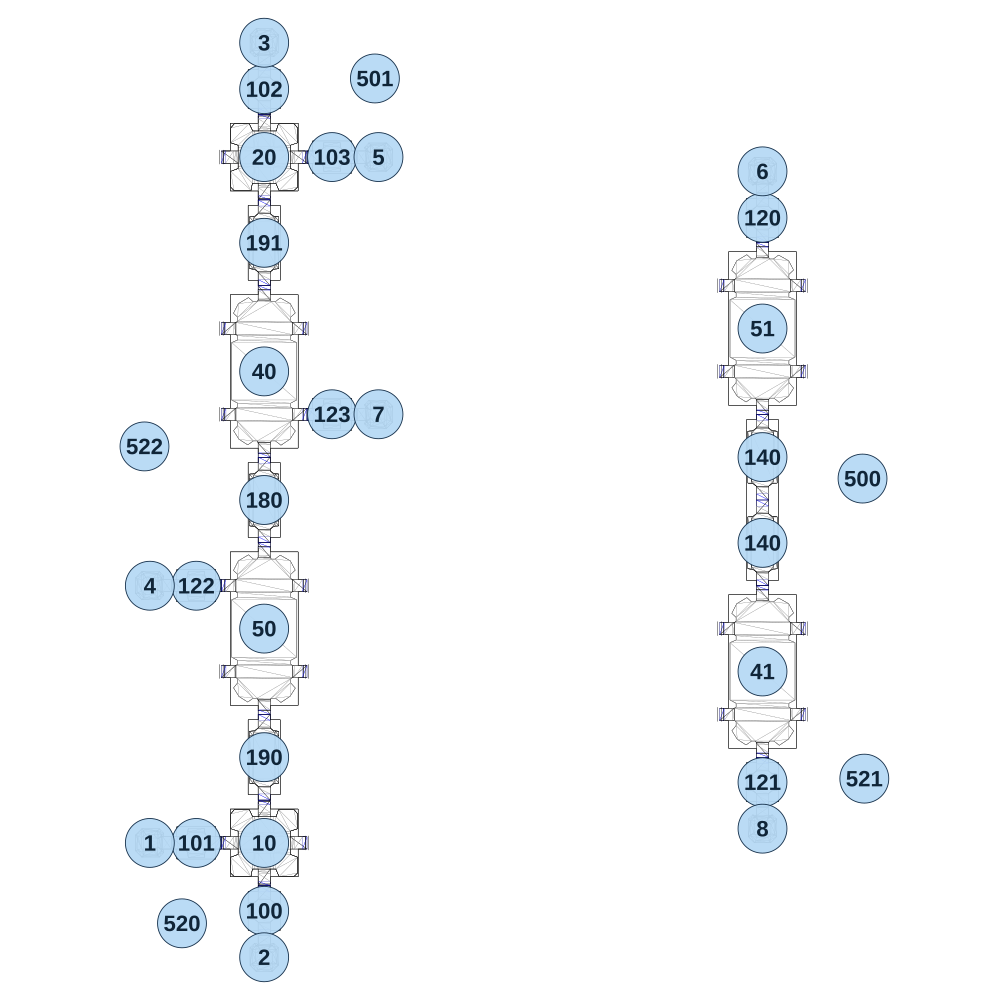

# map_space01_02

[All map wireframes](README.md)

[SVG](map_space01_02.svg) · [PNG](map_space01_02.png) · [Geometry JSON](map_space01_02.json)

## Section reference positions

These are markers, not room boundaries or safe spawn points. Positions use the file’s XYZ axes; the wireframe projects X/Z. Rotation is retained raw, not interpreted here.

| Section ID | X | Y | Z | Raw rotation |
|---:|---:|---:|---:|---:|
| 100 | -1395 | 0 | 1150 | 0 |
| 101 | -1585 | 0 | 960 | 16383 |
| 102 | -1395 | 120 | -1150 | 0 |
| 103 | -1205 | 120 | -960 | 16383 |
| 120 | 0 | 0 | -790 | 0 |
| 121 | 0 | 0 | 790 | 0 |
| 122 | -1585 | 40 | 240 | 16383 |
| 123 | -1205 | 80 | -240 | 16383 |
| 140 | 0 | 0 | 120 | 0 |
| 140 | 0 | 0 | -120 | 0 |
| 180 | -1395 | 40 | 0 | 0 |
| 190 | -1395 | 0 | 720 | 0 |
| 191 | -1395 | 80 | -720 | 0 |
| 1 | -1715 | 0 | 960 | 16383 |
| 2 | -1395 | 0 | 1280 | 32768 |
| 3 | -1395 | 120 | -1280 | 0 |
| 4 | -1715 | 40 | 240 | 16383 |
| 5 | -1075 | 120 | -960 | 49152 |
| 6 | 0 | 0 | -920 | 0 |
| 7 | -1075 | 80 | -240 | 49152 |
| 8 | 0 | 0 | 920 | 32768 |
| 10 | -1395 | 0 | 960 | 0 |
| 20 | -1395 | 120 | -960 | 0 |
| 40 | -1395 | 80 | -360 | 0 |
| 41 | 0 | 0 | 480 | 0 |
| 50 | -1395 | 40 | 360 | 0 |
| 51 | 0 | 0 | -480 | 0 |
| 500 | 280 | -100 | -60 | 23665 |
| 501 | -1085 | -100 | -1180 | 0 |
| 520 | -1625 | -100 | 1185 | 32768 |
| 521 | 285 | -100 | 780 | 49152 |
| 522 | -1730 | 0 | -150 | 9102 |

Collision triangles: 5118. Sentinel/unlabelled records remain in JSON. Overlapping marker positions are preserved, not moved to invent room locations.
