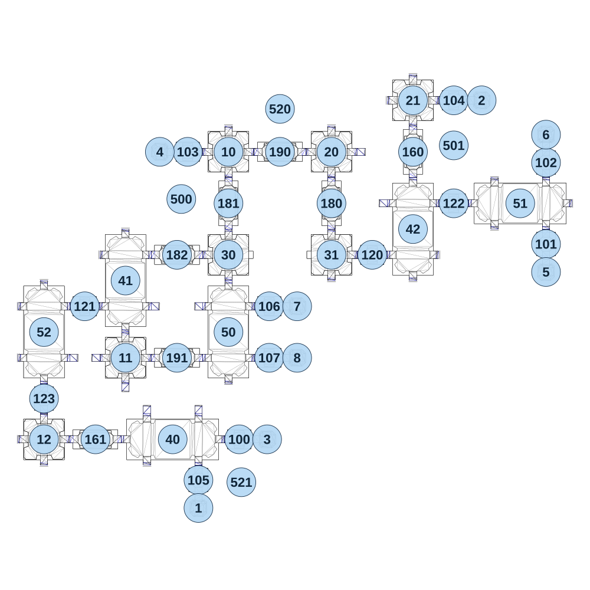

# map_space02_00

[All map wireframes](README.md)

[SVG](map_space02_00.svg) · [PNG](map_space02_00.png) · [Geometry JSON](map_space02_00.json)

## Section reference positions

These are markers, not room boundaries or safe spawn points. Positions use the file’s XYZ axes; the wireframe projects X/Z. Rotation is retained raw, not interpreted here.

| Section ID | X | Y | Z | Raw rotation |
|---:|---:|---:|---:|---:|
| 100 | -190 | 160 | 860 | 16383 |
| 101 | 1240 | 0 | -50 | 0 |
| 102 | 1240 | 0 | -430 | 0 |
| 103 | -430 | 80 | -480 | 16383 |
| 104 | 810 | 0 | -720 | 16383 |
| 105 | -380 | 160 | 1050 | 0 |
| 106 | -50 | 120 | 240 | 16383 |
| 107 | -50 | 120 | 480 | 16383 |
| 120 | 430 | 0 | -0 | 16383 |
| 121 | -910 | 160 | 240 | 16383 |
| 122 | 810 | 0 | -240 | 16383 |
| 123 | -1100 | 160 | 670 | 0 |
| 160 | 620 | 0 | -480 | 0 |
| 161 | -860 | 160 | 860 | 16383 |
| 180 | 240 | 0 | -240 | 0 |
| 181 | -240 | 80 | -240 | 32768 |
| 182 | -480 | 120 | -2e-06 | 16383 |
| 190 | 0 | 40 | -480 | 16383 |
| 191 | -480 | 120 | 480 | 16383 |
| 1 | -380 | 160 | 1180 | 32768 |
| 2 | 940 | 0 | -720 | 49152 |
| 3 | -60 | 160 | 860 | 49152 |
| 4 | -560 | 80 | -480 | 16383 |
| 5 | 1240 | 0 | 80 | 32768 |
| 6 | 1240 | 0 | -560 | 0 |
| 7 | 80 | 120 | 240 | 49152 |
| 8 | 80 | 120 | 480 | 49152 |
| 10 | -240 | 80 | -480 | 0 |
| 11 | -720 | 160 | 480 | 0 |
| 12 | -1100 | 160 | 860 | 0 |
| 20 | 240 | 40 | -480 | 0 |
| 21 | 620 | 0 | -720 | 0 |
| 30 | -240 | 120 | 0 | 49152 |
| 31 | 240 | 0 | -1e-06 | 16383 |
| 40 | -500 | 160 | 860 | 16383 |
| 41 | -720 | 160 | 120 | 0 |
| 42 | 620 | 0 | -120 | 0 |
| 50 | -240 | 120 | 360 | 0 |
| 51 | 1120 | 0 | -240 | 16383 |
| 52 | -1100 | 160 | 360 | 0 |
| 500 | -460 | -100 | -260 | 16383 |
| 501 | 810 | -100 | -510 | 16383 |
| 520 | 0 | -100 | -680 | 0 |
| 521 | -180 | 0 | 1060 | 40960 |

Collision triangles: 8802. Sentinel/unlabelled records remain in JSON. Overlapping marker positions are preserved, not moved to invent room locations.
