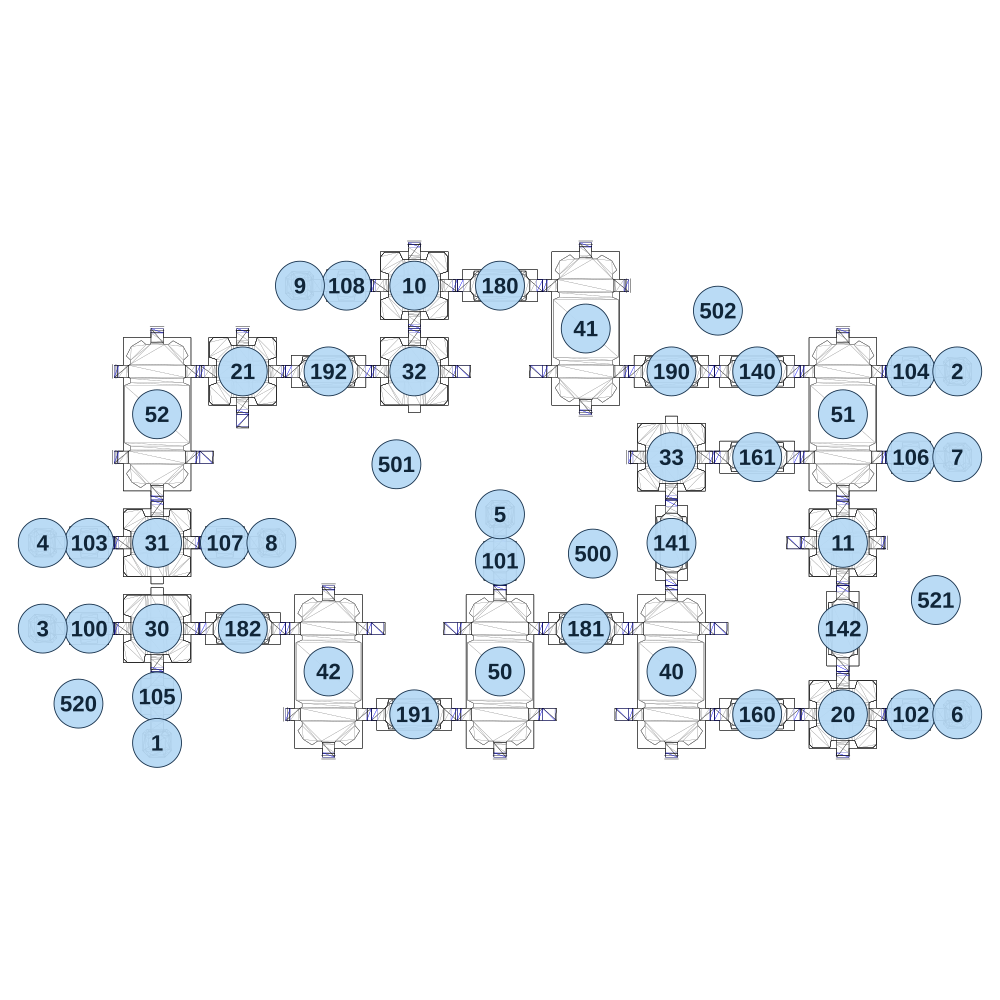

# map_space02_01

[All map wireframes](README.md)

[SVG](map_space02_01.svg) · [PNG](map_space02_01.png) · [Geometry JSON](map_space02_01.json)

## Section reference positions

These are markers, not room boundaries or safe spawn points. Positions use the file’s XYZ axes; the wireframe projects X/Z. Rotation is retained raw, not interpreted here.

| Section ID | X | Y | Z | Raw rotation |
|---:|---:|---:|---:|---:|
| 100 | -1150 | 0 | 320 | 16383 |
| 101 | 0 | 80 | 130 | 0 |
| 102 | 1150 | 120 | 560 | 16383 |
| 103 | -1150 | 0 | 80 | 16383 |
| 104 | 1150 | 120 | -400 | 16383 |
| 105 | -960 | 0 | 510 | 0 |
| 106 | 1150 | 120 | -160 | 16383 |
| 107 | -770 | 0 | 80 | 16383 |
| 108 | -430 | 40 | -640 | 16383 |
| 140 | 720 | 120 | -400 | 16383 |
| 141 | 480 | 120 | 80 | 0 |
| 142 | 960 | 120 | 320 | 0 |
| 160 | 720 | 120 | 560 | 16383 |
| 161 | 720 | 120 | -160 | 16383 |
| 180 | 0 | 40 | -640 | 49152 |
| 181 | 240 | 80 | 320 | 49152 |
| 182 | -720 | 0 | 320 | 49152 |
| 190 | 480 | 80 | -400 | 49152 |
| 191 | -240 | 40 | 560 | 49152 |
| 192 | -480 | 0 | -400 | 49152 |
| 1 | -960 | 0 | 640 | 32768 |
| 2 | 1280 | 120 | -400 | 49152 |
| 3 | -1280 | 0 | 320 | 16383 |
| 4 | -1280 | 0 | 80 | 16383 |
| 5 | 0 | 80 | 0 | 0 |
| 6 | 1280 | 120 | 560 | 49152 |
| 7 | 1280 | 120 | -160 | 49152 |
| 8 | -640 | 0 | 80 | 49152 |
| 9 | -560 | 40 | -640 | 16384 |
| 10 | -240 | 40 | -640 | 0 |
| 11 | 960 | 120 | 80 | 0 |
| 20 | 960 | 120 | 560 | 0 |
| 21 | -720 | 0 | -400 | 0 |
| 30 | -960 | 0 | 320 | 0 |
| 31 | -960 | 0 | 80 | 32768 |
| 32 | -240 | 40 | -400 | 32768 |
| 33 | 480 | 120 | -160 | 0 |
| 40 | 480 | 120 | 440 | 0 |
| 41 | 240 | 80 | -520 | 0 |
| 42 | -480 | 40 | 440 | 0 |
| 50 | 0 | 80 | 440 | 0 |
| 51 | 960 | 120 | -280 | 0 |
| 52 | -960 | 0 | -280 | 0 |
| 500 | 260 | -100 | 110 | 0 |
| 501 | -290 | -100 | -140 | 0 |
| 502 | 610 | -100 | -570 | 0 |
| 520 | -1180 | -100 | 530 | 24576 |
| 521 | 1220 | -100 | 240 | 49152 |

Collision triangles: 9464. Sentinel/unlabelled records remain in JSON. Overlapping marker positions are preserved, not moved to invent room locations.
