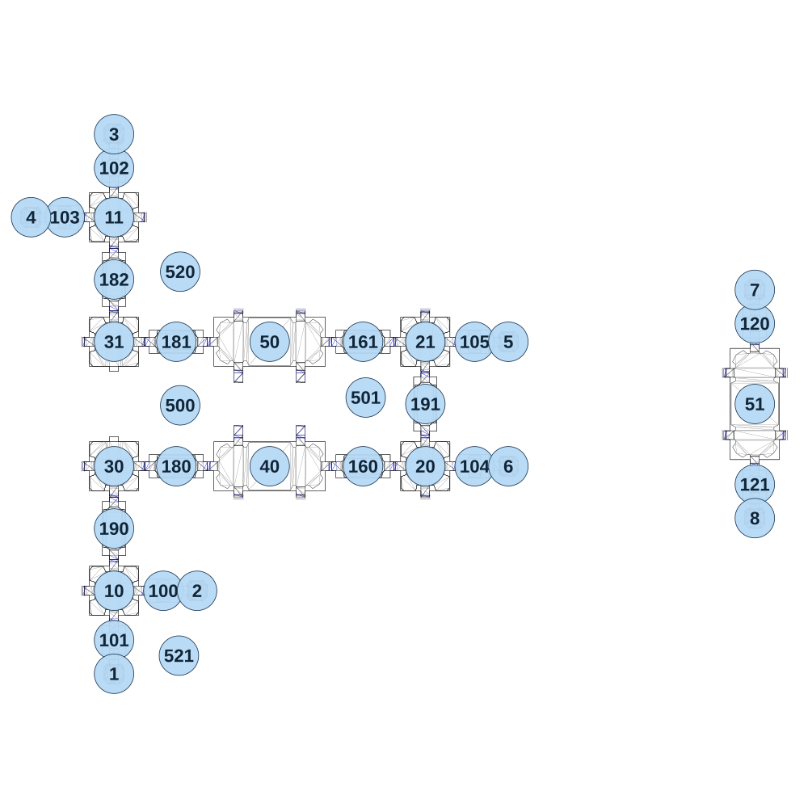

# map_space02_02

[All map wireframes](README.md)

[SVG](map_space02_02.svg) · [PNG](map_space02_02.png) · [Geometry JSON](map_space02_02.json)

## Section reference positions

These are markers, not room boundaries or safe spawn points. Positions use the file’s XYZ axes; the wireframe projects X/Z. Rotation is retained raw, not interpreted here.

| Section ID | X | Y | Z | Raw rotation |
|---:|---:|---:|---:|---:|
| 100 | -1010 | 0 | 720 | 16383 |
| 101 | -1200 | 0 | 910 | 0 |
| 102 | -1200 | 200 | -910 | 0 |
| 103 | -1390 | 200 | -720 | 16383 |
| 104 | 190 | 80 | 240 | 16383 |
| 105 | 190 | 120 | -240 | 16383 |
| 120 | 1270 | 0 | -310 | 0 |
| 121 | 1270 | 0 | 310 | 0 |
| 160 | -240 | 80 | 240 | 16383 |
| 161 | -240 | 120 | -240 | 16383 |
| 180 | -960 | 40 | 240 | 49152 |
| 181 | -960 | 120 | -240 | 16383 |
| 182 | -1200 | 160 | -480 | 0 |
| 190 | -1200 | 0 | 480 | 0 |
| 191 | 0 | 80 | 0 | 0 |
| 1 | -1200 | 0 | 1040 | 32768 |
| 2 | -880 | 0 | 720 | 49152 |
| 3 | -1200 | 200 | -1040 | 0 |
| 4 | -1520 | 200 | -720 | 16383 |
| 5 | 320 | 120 | -240 | 49152 |
| 6 | 320 | 80 | 240 | 49152 |
| 7 | 1270 | 0 | -440 | 0 |
| 8 | 1270 | 0 | 440 | 32768 |
| 10 | -1200 | 0 | 720 | 0 |
| 11 | -1200 | 200 | -720 | 0 |
| 20 | 0 | 80 | 240 | 0 |
| 21 | 0 | 120 | -240 | 0 |
| 30 | -1200 | 40 | 240 | 0 |
| 31 | -1200 | 160 | -240 | 32768 |
| 40 | -600 | 80 | 240 | 16383 |
| 50 | -600 | 120 | -240 | 16383 |
| 51 | 1270 | 0 | 0 | 0 |
| 500 | -945 | -100 | 5 | 41 |
| 501 | -230 | -100 | -25 | 16383 |
| 520 | -945 | -50 | -510 | 58254 |
| 521 | -950 | -100 | 970 | 40960 |

Collision triangles: 6724. Sentinel/unlabelled records remain in JSON. Overlapping marker positions are preserved, not moved to invent room locations.
