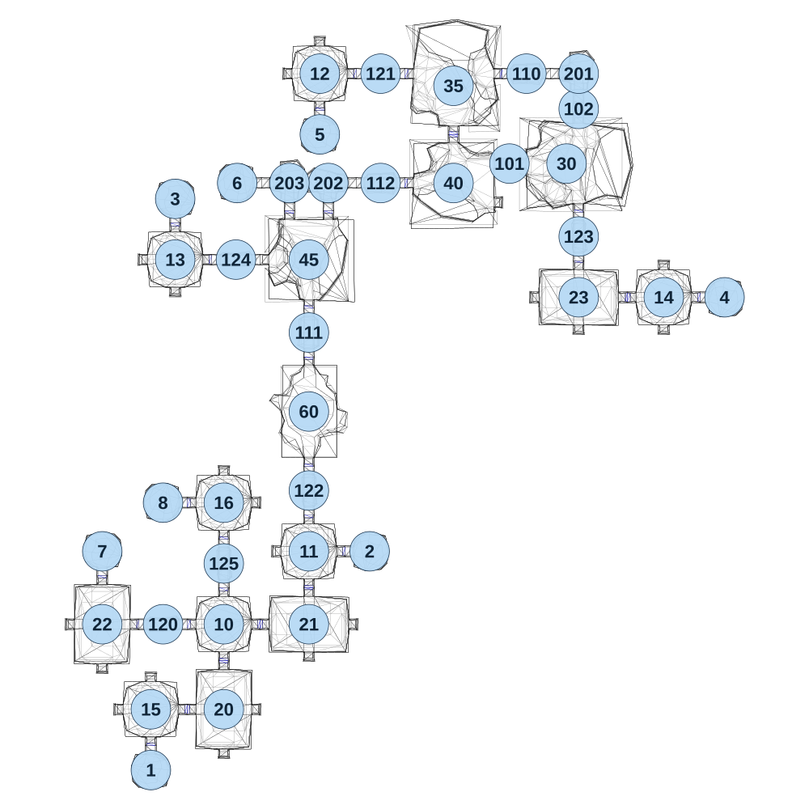

# map_test01_00

[All map wireframes](README.md)

[SVG](map_test01_00.svg) · [PNG](map_test01_00.png) · [Geometry JSON](map_test01_00.json)

## Section reference positions

These are markers, not room boundaries or safe spawn points. Positions use the file’s XYZ axes; the wireframe projects X/Z. Rotation is retained raw, not interpreted here.

| Section ID | X | Y | Z | Raw rotation |
|---:|---:|---:|---:|---:|
| 101 | 1175 | 0 | -2545 | 16383 |
| 102 | 1460 | 0 | -2770 | 0 |
| 110 | 1245 | 0 | -2915 | 49152 |
| 111 | 350 | 0 | -1850 | 0 |
| 112 | 645 | 0 | -2465 | 16383 |
| 201 | 1460 | 0 | -2915 | 49152 |
| 202 | 430 | 0 | -2465 | 0 |
| 203 | 270 | 0 | -2465 | 49152 |
| 1 | -300 | 0 | -50 | 4294934528 |
| 2 | 600 | 0 | -950 | 49152 |
| 3 | -200 | 0 | -2400 | 0 |
| 4 | 2060 | 0 | -1995 | 49152 |
| 5 | 395 | 0 | -2665 | 32768 |
| 6 | 55 | 0 | -2465 | 16384 |
| 7 | -500 | 0 | -950 | 0 |
| 8 | -250 | 0 | -1150 | 16383 |
| 30 | 1410 | 0 | -2545 | 49152 |
| 35 | 945 | 0 | -2865 | 0 |
| 40 | 945 | 0 | -2465 | 49152 |
| 45 | 350 | 0 | -2150 | 0 |
| 20 | 0 | 0 | -300 | 0 |
| 21 | 350 | 0 | -650 | 16383 |
| 22 | -500 | 0 | -650 | 0 |
| 23 | 1460 | 0 | -1995 | 16383 |
| 10 | 0 | 0 | -650 | 0 |
| 11 | 350 | 0 | -950 | 0 |
| 12 | 395 | 0 | -2915 | 0 |
| 13 | -200 | 0 | -2150 | 0 |
| 14 | 1810 | 0 | -1995 | 0 |
| 15 | -300 | 0 | -300 | 0 |
| 16 | 0 | 0 | -1150 | 0 |
| 120 | -250 | 0 | -650 | 16383 |
| 121 | 645 | 0 | -2915 | 16383 |
| 122 | 350 | 0 | -1200 | 0 |
| 123 | 1460 | 0 | -2245 | 0 |
| 124 | 50 | 0 | -2150 | 16383 |
| 125 | 0 | 0 | -900 | 0 |
| 60 | 350 | 0 | -1525 | 0 |

Collision triangles: 7360. Sentinel/unlabelled records remain in JSON. Overlapping marker positions are preserved, not moved to invent room locations.
