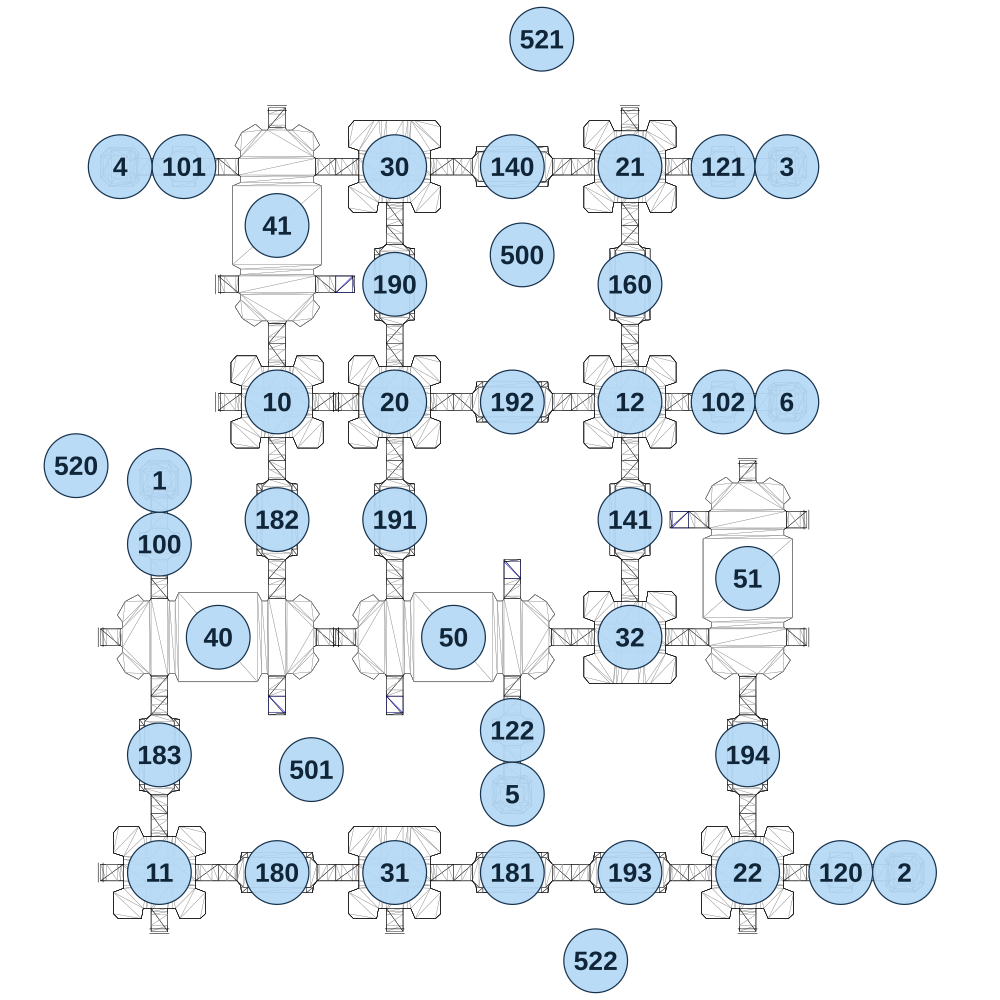

# map_vs01_00

[All map wireframes](README.md)

[SVG](map_vs01_00.svg) · [PNG](map_vs01_00.png) · [Geometry JSON](map_vs01_00.json)

## Section reference positions

These are markers, not room boundaries or safe spawn points. Positions use the file’s XYZ axes; the wireframe projects X/Z. Rotation is retained raw, not interpreted here.

| Section ID | X | Y | Z | Raw rotation |
|---:|---:|---:|---:|---:|
| 100 | -480 | 80 | 50 | 0 |
| 101 | -430 | 40 | -720 | 16383 |
| 102 | 670 | 40 | -240 | 16383 |
| 120 | 910 | 80 | 720 | 16383 |
| 121 | 670 | 40 | -720 | 16383 |
| 122 | 240 | 40 | 430 | 0 |
| 140 | 240 | 40 | -720 | 16383 |
| 141 | 480 | 40 | 0 | 0 |
| 160 | 480 | 40 | -480 | 0 |
| 180 | -240 | 0 | 720 | 16383 |
| 181 | 240 | 0 | 720 | 49152 |
| 182 | -240 | 40 | 0 | 32768 |
| 183 | -480 | 40 | 480 | 0 |
| 190 | 0 | 40 | -480 | 32768 |
| 191 | 0 | 40 | 0 | 0 |
| 192 | 240 | 40 | -240 | 16383 |
| 193 | 480 | 40 | 720 | 49152 |
| 194 | 720 | 40 | 480 | 32768 |
| 1 | -480 | 80 | -80 | 0 |
| 2 | 1040 | 80 | 720 | 49152 |
| 3 | 800 | 40 | -720 | 49152 |
| 4 | -560 | 40 | -720 | 16383 |
| 5 | 240 | 40 | 560 | 32768 |
| 6 | 800 | 40 | -240 | 49152 |
| 10 | -240 | 40 | -240 | 0 |
| 11 | -480 | 40 | 720 | 0 |
| 12 | 480 | 40 | -240 | 0 |
| 20 | 0 | 80 | -240 | 0 |
| 21 | 480 | 40 | -720 | 0 |
| 22 | 720 | 80 | 720 | 0 |
| 30 | 0 | 40 | -720 | 0 |
| 31 | -1e-06 | 0 | 720 | 0 |
| 32 | 480 | 40 | 240 | 32768 |
| 40 | -360 | 80 | 240 | 16383 |
| 41 | -240 | 40 | -600 | 0 |
| 50 | 120 | 40 | 240 | 16383 |
| 51 | 720 | 40 | 120 | 0 |
| 500 | 260 | -100 | -540 | 0 |
| 501 | -170 | -100 | 510 | 0 |
| 520 | -650 | -100 | -110 | 16383 |
| 521 | 300 | -100 | -980 | 0 |
| 522 | 410 | -100 | 900 | 32768 |

Collision triangles: 6508. Sentinel/unlabelled records remain in JSON. Overlapping marker positions are preserved, not moved to invent room locations.
