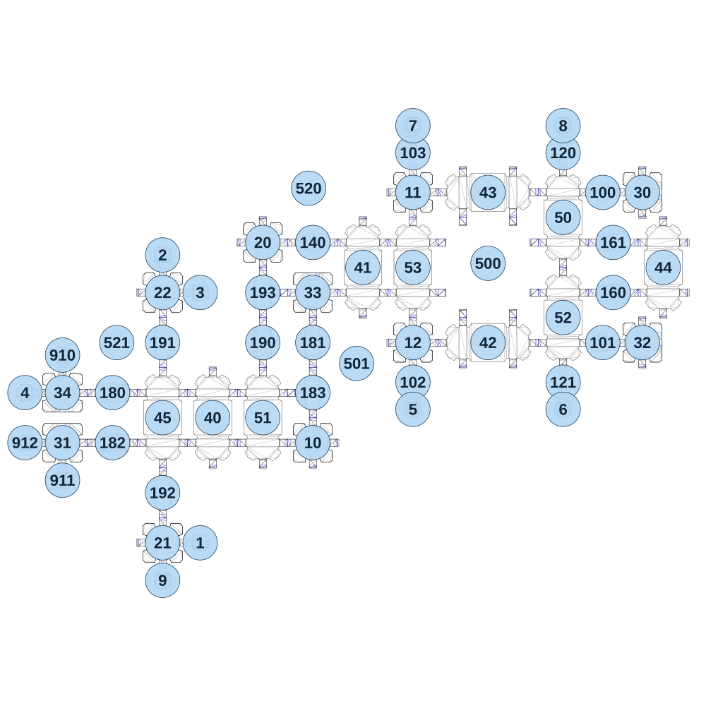

# map_vs01_01

[All map wireframes](README.md)

[SVG](map_vs01_01.svg) · [PNG](map_vs01_01.png) · [Geometry JSON](map_vs01_01.json)

## Section reference positions

These are markers, not room boundaries or safe spawn points. Positions use the file’s XYZ axes; the wireframe projects X/Z. Rotation is retained raw, not interpreted here.

| Section ID | X | Y | Z | Raw rotation |
|---:|---:|---:|---:|---:|
| 100 | 1390 | 40 | -480 | 16383 |
| 101 | 1390 | 40 | 240 | 16383 |
| 102 | 480 | 40 | 430 | 0 |
| 103 | 480 | 40 | -670 | 0 |
| 120 | 1200 | 40 | -670 | 0 |
| 121 | 1200 | 40 | 430 | 0 |
| 140 | 0 | 40 | -240 | 16383 |
| 160 | 1440 | 40 | 0 | 16383 |
| 161 | 1440 | 40 | -240 | 16383 |
| 180 | -960 | 0 | 480 | 49152 |
| 181 | 0 | -0 | 240 | 0 |
| 182 | -960 | 0 | 720 | 49152 |
| 183 | 0 | -0 | 480 | 32768 |
| 190 | -240 | 40 | 240 | 0 |
| 191 | -720 | 0 | 240 | 32768 |
| 192 | -720 | 0 | 960 | 0 |
| 193 | -240 | 40 | 0 | 32768 |
| 1 | -540 | 0 | 1200 | 49152 |
| 2 | -720 | 0 | -180 | 0 |
| 3 | -540 | 0 | 0 | 49152 |
| 4 | -1380 | 0 | 480 | 16383 |
| 5 | 480 | 40 | 560 | 32768 |
| 6 | 1200 | 40 | 560 | 32768 |
| 7 | 480 | 40 | -800 | 0 |
| 8 | 1200 | 40 | -800 | 0 |
| 9 | -720 | 0 | 1380 | 32768 |
| 910 | -1200 | 0 | 300 | 0 |
| 911 | -1200 | 0 | 900 | 32768 |
| 912 | -1380 | 0 | 720 | 16383 |
| 10 | 0 | 40 | 720 | 0 |
| 11 | 480 | 40 | -480 | 0 |
| 12 | 480 | 40 | 240 | 0 |
| 20 | -240 | 40 | -240 | 0 |
| 21 | -720 | 0 | 1200 | 0 |
| 22 | -720 | 0 | 0 | 0 |
| 30 | 1580 | 40 | -480 | 49152 |
| 31 | -1200 | 0 | 720 | 0 |
| 32 | 1580 | 40 | 240 | 49152 |
| 33 | 0 | 40 | 0 | 0 |
| 34 | -1200 | 0 | 480 | 32768 |
| 40 | -480 | 40 | 600 | 0 |
| 41 | 240 | 40 | -120 | 0 |
| 42 | 840 | 40 | 240 | 16383 |
| 43 | 840 | 40 | -480 | 16383 |
| 44 | 1680 | 40 | -120 | 0 |
| 45 | -720 | 40 | 600 | 0 |
| 50 | 1200 | 40 | -360 | 0 |
| 51 | -240 | 40 | 600 | 0 |
| 52 | 1200 | 40 | 120 | 0 |
| 53 | 480 | 40 | -120 | 0 |
| 500 | 840 | -50 | -140 | 16383 |
| 501 | 210 | -50 | 340 | 16383 |
| 520 | -20 | -50 | -500 | 0 |
| 521 | -940 | -50 | 240 | 0 |

Collision triangles: 9240. Sentinel/unlabelled records remain in JSON. Overlapping marker positions are preserved, not moved to invent room locations.
