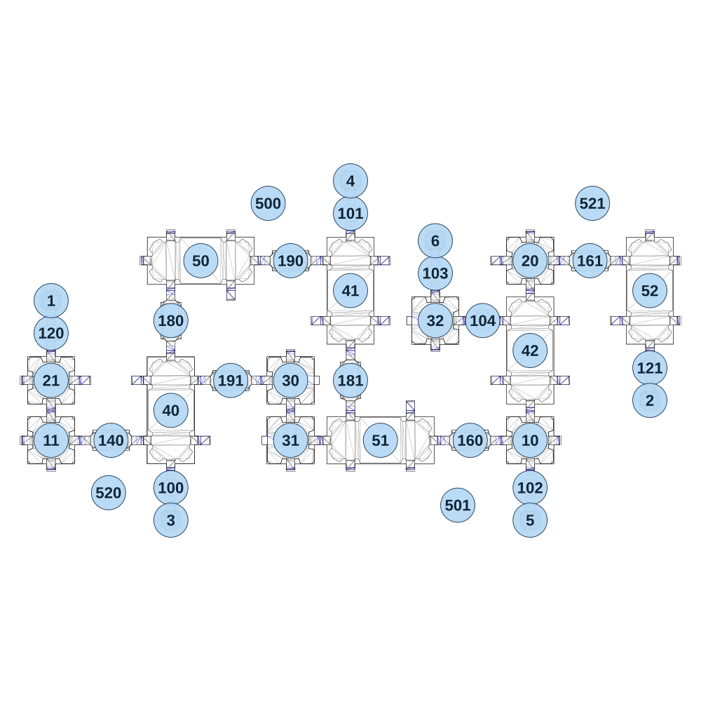

# map_vs01_02

[All map wireframes](README.md)

[SVG](map_vs01_02.svg) · [PNG](map_vs01_02.png) · [Geometry JSON](map_vs01_02.json)

## Section reference positions

These are markers, not room boundaries or safe spawn points. Positions use the file’s XYZ axes; the wireframe projects X/Z. Rotation is retained raw, not interpreted here.

| Section ID | X | Y | Z | Raw rotation |
|---:|---:|---:|---:|---:|
| 100 | -330 | 0 | 370 | 0 |
| 101 | 390 | 0 | -730 | 0 |
| 102 | 1110 | 40 | 370 | 0 |
| 103 | 730 | 40 | -490 | 0 |
| 104 | 920 | 40 | -300 | 16383 |
| 120 | -810 | 0 | -250 | 0 |
| 121 | 1590 | 40 | -110 | 0 |
| 140 | -570 | 0 | 180 | 16383 |
| 160 | 870 | 40 | 180 | 16383 |
| 161 | 1350 | 40 | -540 | 16383 |
| 180 | -330 | 0 | -300 | 0 |
| 181 | 390 | 0 | -60 | 32768 |
| 190 | 150 | 0 | -540 | 16384 |
| 191 | -90 | 0 | -60 | 49152 |
| 1 | -810 | 0 | -380 | 0 |
| 2 | 1590 | 40 | 20 | 32768 |
| 3 | -330 | 0 | 500 | 32768 |
| 4 | 390 | 0 | -860 | 0 |
| 5 | 1110 | 40 | 500 | 32768 |
| 6 | 730 | 40 | -620 | 0 |
| 10 | 1110 | 40 | 180 | 0 |
| 11 | -810 | 0 | 180 | 0 |
| 20 | 1110 | 40 | -540 | 0 |
| 21 | -810 | 0 | -60 | 0 |
| 30 | 150 | 40 | -60 | 49152 |
| 31 | 150 | 40 | 180 | 16383 |
| 32 | 730 | 40 | -300 | 16383 |
| 40 | -330 | 0 | 60 | 0 |
| 41 | 390 | 0 | -420 | 0 |
| 42 | 1110 | 40 | -180 | 0 |
| 50 | -210 | 40 | -540 | 16383 |
| 51 | 510 | 40 | 180 | 16383 |
| 52 | 1590 | 40 | -420 | 0 |
| 500 | 60 | -50 | -770 | 0 |
| 501 | 820 | -50 | 440 | 0 |
| 520 | -580 | -50 | 390 | 16383 |
| 521 | 1360 | -50 | -770 | 49152 |

Collision triangles: 7216. Sentinel/unlabelled records remain in JSON. Overlapping marker positions are preserved, not moved to invent room locations.
