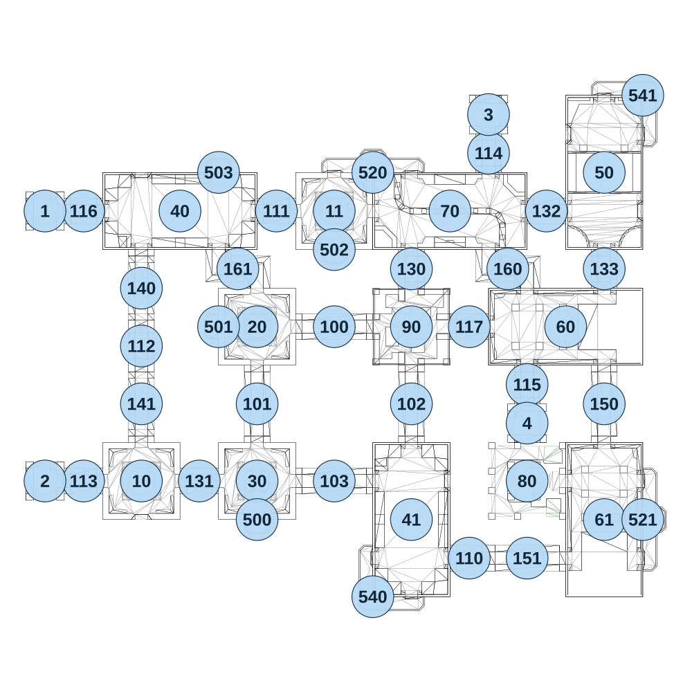

# map_vs02_00

[All map wireframes](README.md)

[SVG](map_vs02_00.svg) · [PNG](map_vs02_00.png) · [Geometry JSON](map_vs02_00.json)

## Section reference positions

These are markers, not room boundaries or safe spawn points. Positions use the file’s XYZ axes; the wireframe projects X/Z. Rotation is retained raw, not interpreted here.

| Section ID | X | Y | Z | Raw rotation |
|---:|---:|---:|---:|---:|
| 100 | -240 | 0 | 0 | 16383 |
| 101 | -480 | 0 | 240 | 0 |
| 102 | 1e-06 | 0 | 240 | 0 |
| 103 | -240 | 0 | 480 | 16384 |
| 110 | 180 | 0 | 720 | 16383 |
| 111 | -420 | 0 | -360 | 16383 |
| 112 | -840 | 0 | 60 | 0 |
| 113 | -1020 | 0 | 480 | 16383 |
| 114 | 240 | 0 | -540 | 0 |
| 115 | 360 | 0 | 180 | 0 |
| 116 | -1020 | 0 | -360 | 16383 |
| 117 | 180 | 0 | 0 | 16383 |
| 130 | 1e-06 | 0 | -180 | 32768 |
| 131 | -660 | 0 | 480 | 16383 |
| 132 | 420 | 0 | -360 | 49152 |
| 133 | 600 | 0 | -180 | 0 |
| 140 | -840 | 0 | -120 | 0 |
| 141 | -840 | 0 | 240 | 0 |
| 150 | 600 | 0 | 240 | 0 |
| 151 | 360 | 0 | 720 | 16383 |
| 160 | 300 | 0 | -180 | 0 |
| 161 | -540 | 0 | -180 | 0 |
| 10 | -840 | 0 | 480 | 0 |
| 11 | -240 | 0 | -360 | 0 |
| 20 | -480 | 0 | 0 | 0 |
| 30 | -480 | 0 | 480 | 32768 |
| 40 | -720 | 0 | -360 | 16383 |
| 41 | 0 | 0 | 600 | 0 |
| 50 | 600 | 0 | -480 | 0 |
| 60 | 480 | 0 | 0 | 49152 |
| 61 | 600 | 0 | 600 | 32768 |
| 70 | 120 | 0 | -360 | 16383 |
| 1 | -1140 | 0 | -360 | 16383 |
| 2 | -1140 | 0 | 480 | 16383 |
| 3 | 240 | 0 | -660 | 0 |
| 4 | 360 | 0 | 300 | 32768 |
| 500 | -480 | 0 | 600 | 0 |
| 501 | -600 | 0 | -1e-06 | 49152 |
| 502 | -240 | 0 | -240 | 0 |
| 503 | -600 | 0 | -480 | 32768 |
| 520 | -120 | 0 | -480 | 32768 |
| 521 | 720 | 0 | 600 | 16383 |
| 540 | -120 | 0 | 840 | 49152 |
| 541 | 720 | 0 | -720 | 16383 |
| 80 | 360 | 0 | 480 | 16383 |
| 90 | 0 | 0 | 0 | 0 |

Collision triangles: 5551. Sentinel/unlabelled records remain in JSON. Overlapping marker positions are preserved, not moved to invent room locations.
