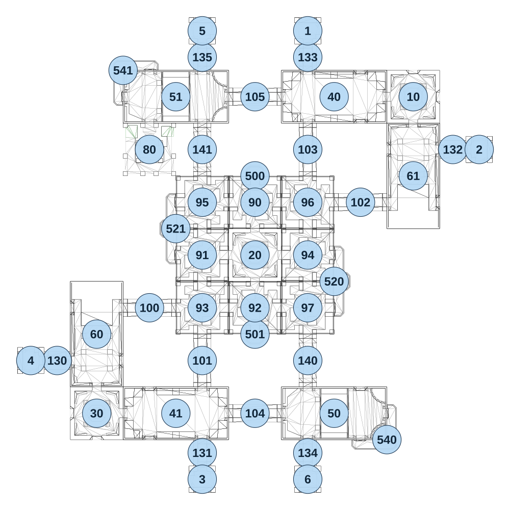

# map_vs02_01

[All map wireframes](README.md)

[SVG](map_vs02_01.svg) · [PNG](map_vs02_01.png) · [Geometry JSON](map_vs02_01.json)

## Section reference positions

These are markers, not room boundaries or safe spawn points. Positions use the file’s XYZ axes; the wireframe projects X/Z. Rotation is retained raw, not interpreted here.

| Section ID | X | Y | Z | Raw rotation |
|---:|---:|---:|---:|---:|
| 100 | -480 | 0 | 240 | 16383 |
| 101 | -240 | 0 | 480 | 0 |
| 102 | 480 | 0 | -240 | 16383 |
| 103 | 240 | 0 | -480 | 0 |
| 104 | 0 | 0 | 720 | 16383 |
| 105 | 0 | 0 | -720 | 16383 |
| 130 | -900 | 0 | 480 | 49152 |
| 131 | -240 | 0 | 900 | 32768 |
| 132 | 900 | 0 | -480 | 16383 |
| 133 | 240 | 0 | -900 | 0 |
| 134 | 240 | 0 | 900 | 0 |
| 135 | -240 | 0 | -900 | 32768 |
| 140 | 240 | 0 | 480 | 0 |
| 141 | -240 | 0 | -480 | 0 |
| 10 | 720 | 0 | -720 | 0 |
| 20 | 0 | 0 | 0 | 0 |
| 30 | -720 | 0 | 720 | 49152 |
| 40 | 360 | 0 | -720 | 16383 |
| 41 | -360 | 0 | 720 | 16383 |
| 50 | 360 | 0 | 720 | 16383 |
| 51 | -360 | 0 | -720 | 16383 |
| 60 | -720 | 0 | 360 | 0 |
| 61 | 720 | 0 | -360 | 32768 |
| 1 | 240 | 0 | -1020 | 0 |
| 2 | 1020 | 0 | -480 | 49152 |
| 3 | -240 | 0 | 1020 | 32768 |
| 4 | -1020 | 0 | 480 | 16383 |
| 5 | -240 | 0 | -1020 | 0 |
| 6 | 240 | 0 | 1020 | 32768 |
| 500 | 0 | 0 | -360 | 32768 |
| 501 | 0 | 0 | 360 | 0 |
| 520 | 360 | 0 | 120 | 16383 |
| 521 | -360 | 0 | -120 | 49152 |
| 540 | 600 | 0 | 840 | 0 |
| 541 | -600 | 0 | -840 | 32768 |
| 80 | -480 | 0 | -480 | 32768 |
| 90 | 0 | 0 | -240 | 16383 |
| 91 | -240 | 0 | 0 | 0 |
| 92 | 0 | 0 | 240 | 49152 |
| 93 | -240 | 0 | 240 | 0 |
| 94 | 240 | 0 | 0 | 32768 |
| 95 | -240 | 0 | -240 | 32768 |
| 96 | 240 | 0 | -240 | 49152 |
| 97 | 240 | 0 | 240 | 0 |

Collision triangles: 6795. Sentinel/unlabelled records remain in JSON. Overlapping marker positions are preserved, not moved to invent room locations.
