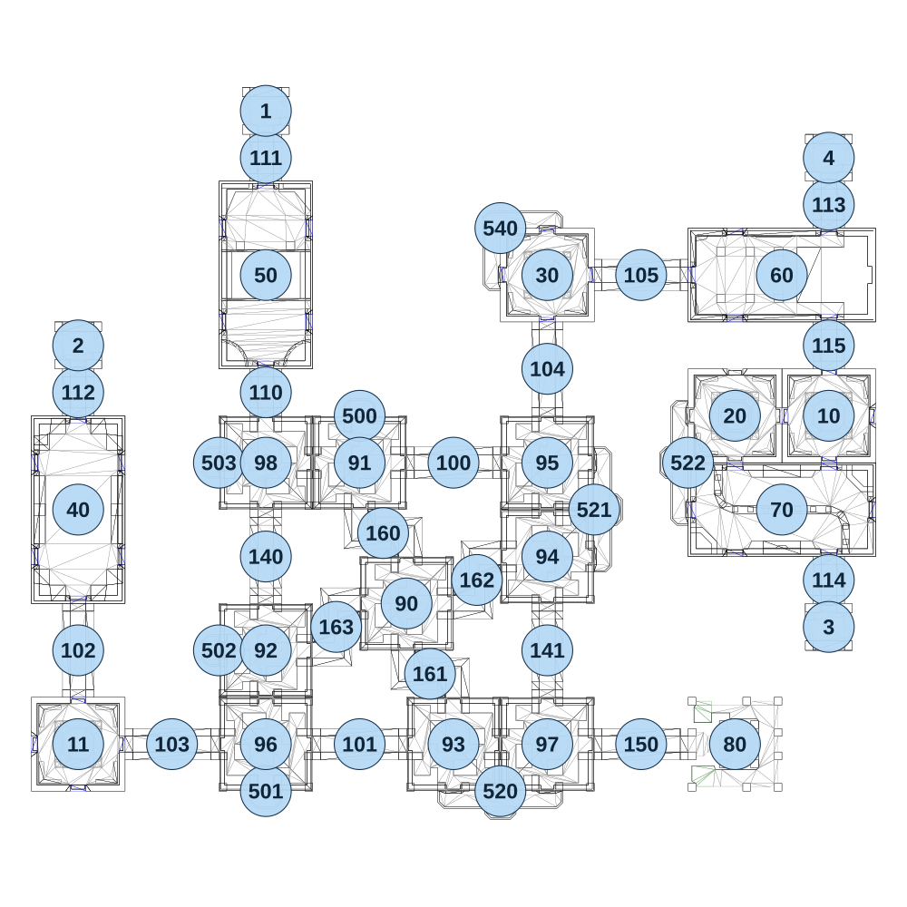

# map_vs02_02

[All map wireframes](README.md)

[SVG](map_vs02_02.svg) · [PNG](map_vs02_02.png) · [Geometry JSON](map_vs02_02.json)

## Section reference positions

These are markers, not room boundaries or safe spawn points. Positions use the file’s XYZ axes; the wireframe projects X/Z. Rotation is retained raw, not interpreted here.

| Section ID | X | Y | Z | Raw rotation |
|---:|---:|---:|---:|---:|
| 100 | 120 | 0 | -360 | 16383 |
| 101 | -120 | 0 | 360 | 16383 |
| 102 | -840 | 0 | 120 | 0 |
| 103 | -600 | 0 | 360 | 16383 |
| 104 | 360 | 0 | -600 | 0 |
| 105 | 600 | 0 | -840 | 16383 |
| 110 | -360 | 0 | -540 | 0 |
| 111 | -360 | 0 | -1140 | 0 |
| 112 | -840 | 0 | -540 | 0 |
| 113 | 1080 | 0 | -1020 | 0 |
| 114 | 1080 | 0 | -60 | 0 |
| 115 | 1080 | 0 | -660 | 0 |
| 140 | -360 | 0 | -120 | 0 |
| 141 | 360 | 0 | 120 | 0 |
| 150 | 600 | 0 | 360 | 16383 |
| 160 | -60 | 0 | -180 | 0 |
| 161 | 60 | 0 | 180 | 0 |
| 162 | 180 | 0 | -60 | 16383 |
| 163 | -180 | 0 | 60 | 16383 |
| 10 | 1080 | 0 | -480 | 0 |
| 11 | -840 | 0 | 360 | 0 |
| 20 | 840 | 0 | -480 | 0 |
| 30 | 360 | 0 | -840 | 0 |
| 40 | -840 | 0 | -240 | 0 |
| 50 | -360 | 0 | -840 | 0 |
| 60 | 960 | 0 | -840 | 49152 |
| 70 | 960 | 0 | -240 | 16383 |
| 1 | -360 | 0 | -1260 | 0 |
| 2 | -840 | 0 | -660 | 0 |
| 3 | 1080 | 0 | 60 | 32768 |
| 4 | 1080 | 0 | -1140 | 0 |
| 500 | -120 | 0 | -480 | 32768 |
| 501 | -360 | 0 | 480 | 0 |
| 502 | -480 | 0 | 120 | 49152 |
| 503 | -480 | 0 | -360 | 49152 |
| 520 | 240 | 0 | 480 | 0 |
| 521 | 480 | 0 | -240 | 16383 |
| 522 | 720 | 0 | -360 | 49152 |
| 540 | 240 | 0 | -960 | 32768 |
| 80 | 840 | 0 | 360 | 49152 |
| 90 | 0 | 0 | 0 | 0 |
| 91 | -120 | 0 | -360 | 0 |
| 92 | -360 | 0 | 120 | 0 |
| 93 | 120 | 0 | 360 | 16383 |
| 94 | 360 | 0 | -120 | 32768 |
| 95 | 360 | 0 | -360 | 0 |
| 96 | -360 | 0 | 360 | 49152 |
| 97 | 360 | 0 | 360 | 0 |
| 98 | -360 | 0 | -360 | 16383 |

Collision triangles: 8475. Sentinel/unlabelled records remain in JSON. Overlapping marker positions are preserved, not moved to invent room locations.
